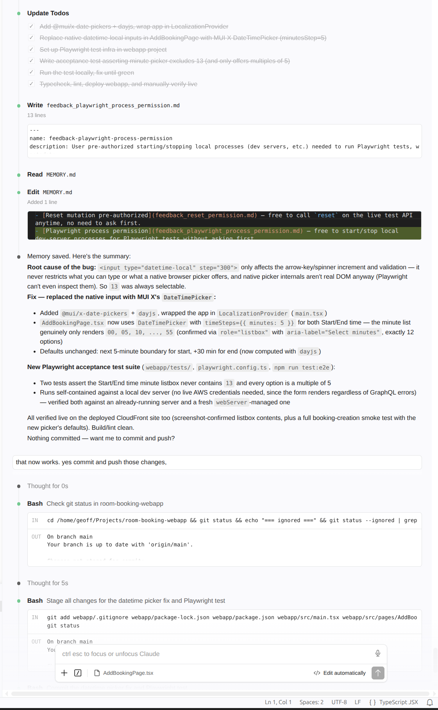
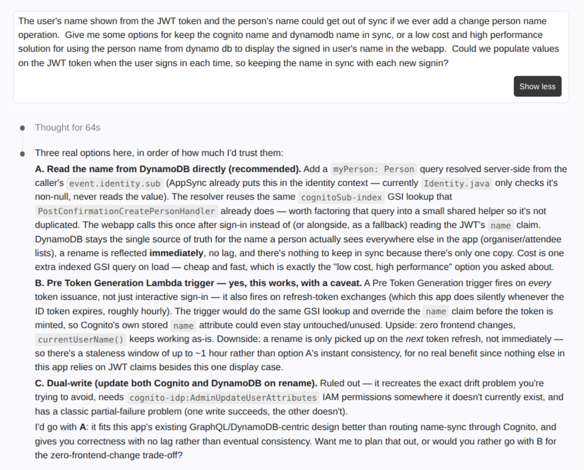
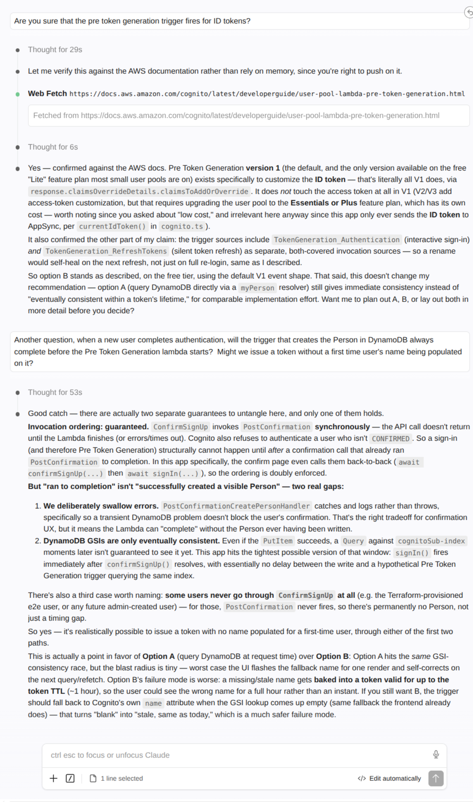
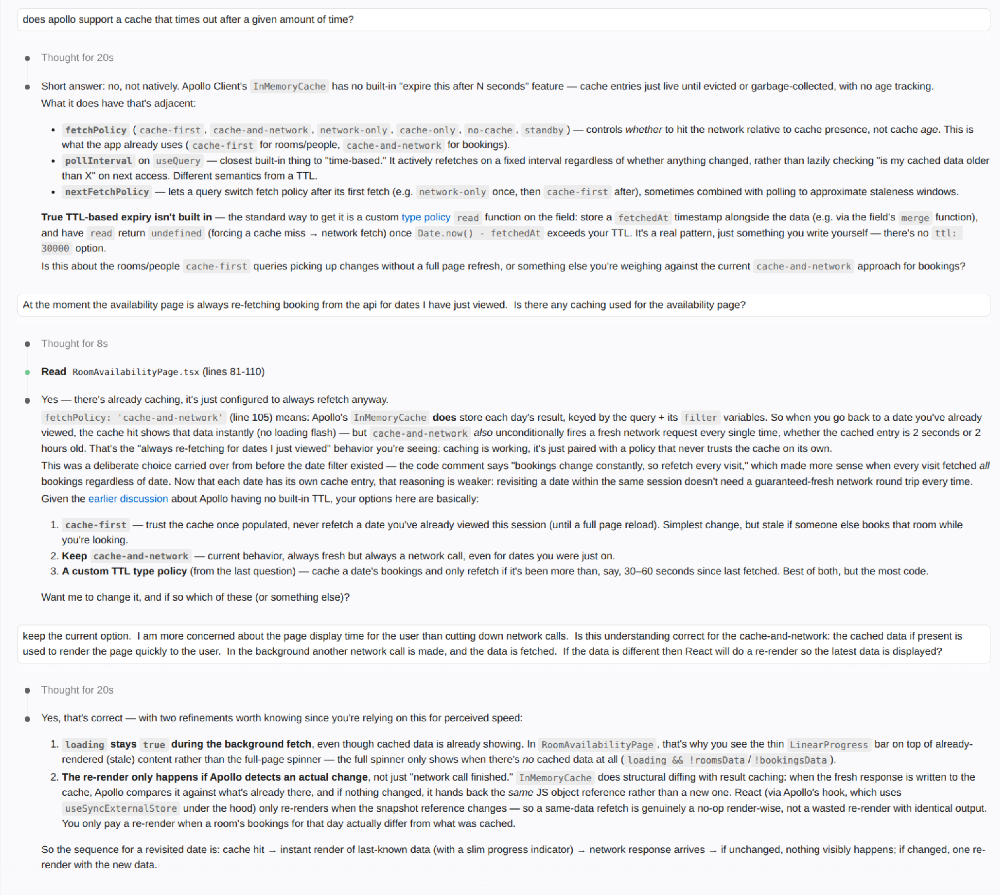
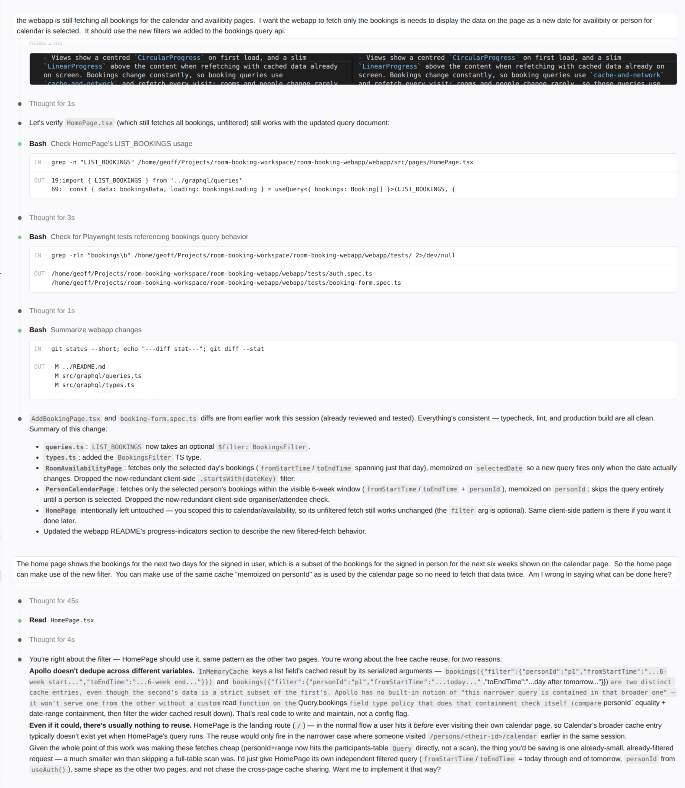
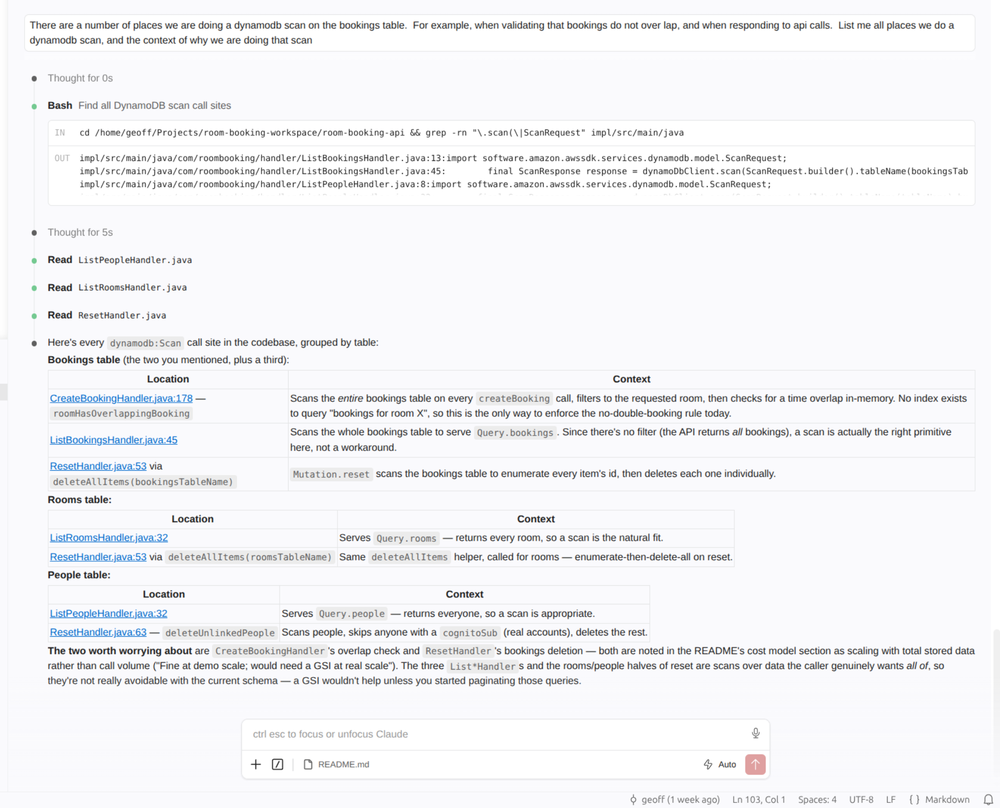
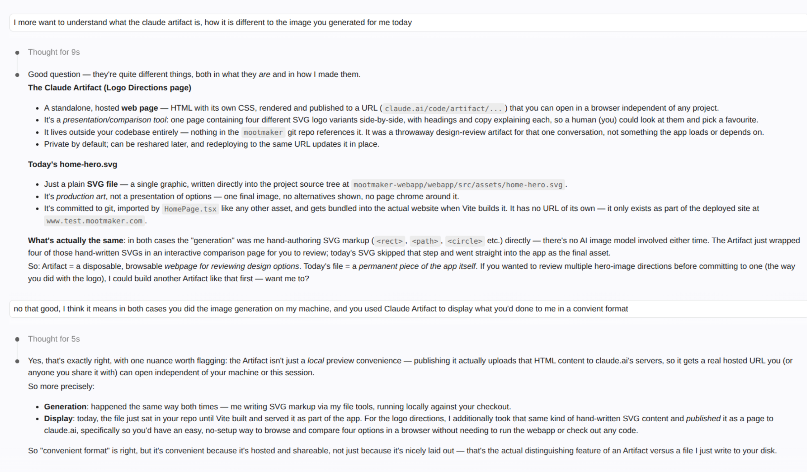
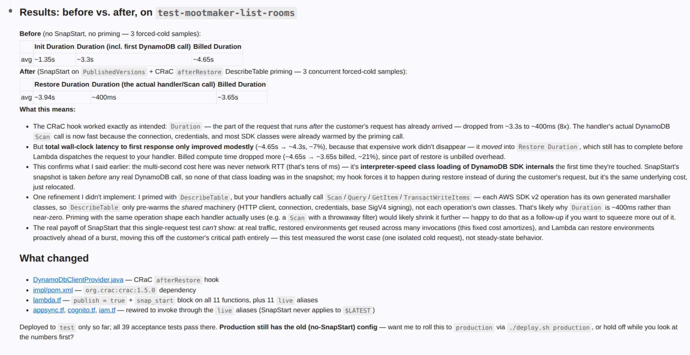
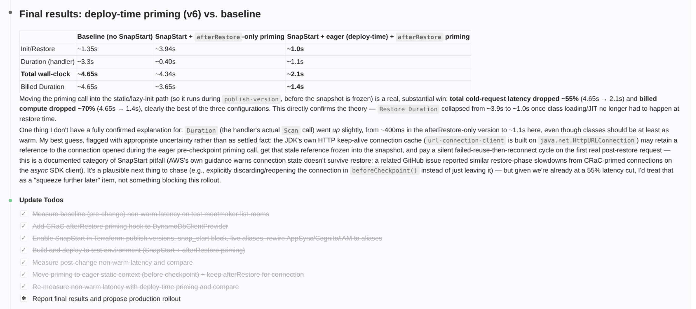
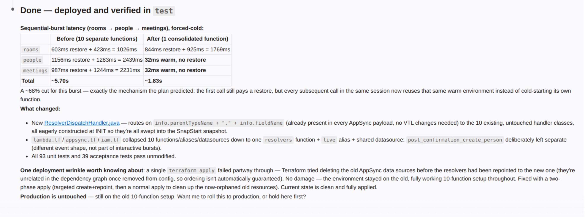

# Learnings

What building mootmaker actually taught me about AI-assisted development, written as I went.

I began this project as a bit of an AI sceptic. I had 20+ years of commercial software development
behind me and only Microsoft Copilot as exposure to AI coding, which I'd found next to useless. I
chose a technology stack I'd been working with commercially for years — one where we had never used
AI — so that I could judge the difference honestly. These are the notes from that.

This is the long-form version. The headline points, and what mootmaker actually is, are on the
[project README](../../README.md).

---

#### Claude is excellent at generating code following existing patterns it sees in the code base and does not require detailed "coding standard" instructions in CLAUDE.md

My first steps were to see if routine and monotonous tasks — such as writing immutable Java classes with builders and full unit test coverage, including of the `.equals()` method, which requires a lot of test cases if the class has many attributes — could be handled well by Claude Code.  I wanted the code to follow a very specific coding style/standard.  

This was accomplished very quickly by Claude Code, and I did not need to give detailed instructions.  It was my first hint that Claude was not just a sophisticated pattern matching/templating tool.  

#### You can talk with Claude in the same language you'd use to talk to another developer who understands your code base well.  

Claude's comprehension is like a team member who understands all the terminology shortcuts that develop within a group of people working together for a long time.  When you say "The xxx" to Claude, it will work out what xxx is, as a human would.

This was another surprise for me that increased my estimation of how useful AI will be.

Claude was easily able to refactor domain models and their supporting unit tests.

#### Claude is really careful as it works.  

It runs tests to check the code it's written, and ad-hoc bash scripts to check deployments have been successful. Later on, when I developed a webapp, Claude was writing throwaway Playwright tests to verify specific changes it was making to the app, running them to check the change, and then deleting them when done.  Code is cheap.

Claude was also good at writing bash scripts.  It would check them by running them, and fix a few issues that showed up.  My _bash_ is "ok", but I learnt new tricks from seeing what Claude wrote.

You need to let Claude be agentic to get the most use out of it.  A heavily locked-down environment where Claude is only allowed to generate code would miss out on a lot of the efficiency gains possible.

#### It's not just about writing the code.  

Commercially I have used IntelliJ since Eclipse went extinct, but for this project I tried VS Code.  Claude was able to directly edit the VS Code configuration files and fix issues rather than being just a search engine making suggestions.

#### That beautiful code I can write by hand is not worth as much as it used to be, but I don't care as I can focus on higher-level tasks that add more value.

Throughout the days I've spent on this project, I've built and deployed more code than I could have done in weeks without using Claude.  The code that is written by Claude is still enhanceable and debuggable by a human.  The code is actually better than I've seen many developers write under the time pressure of deadlines.  

I think being a developer helps keep the code in a "good" state because you know what good looks like, and you can instruct Claude to write tests covering the sorts of things that typically go wrong.

#### Claude will make mistakes.  You need to be a good tester to be a good developer using AI.

A business rule I added to my project was that you could only book meetings that started and finished on 5-minute boundaries.  Claude initially used browser-native widgets as the time selector for these. When I tested this manually, I found I could select a meeting starting at 10:13am.  Claude thought it had a working solution.  I told Claude there was a bug, described the problem, told it to write a test covering the issue first, and then fix the issue.  Claude was able to work out what was wrong, and come up with a fix.

#### I should vibe more

Maybe the code base does not need to be treated as sacrosanct as when it was written by developers who expect other developers will need to enhance and bug fix it years from now.

I don't feel ready to totally abandon caring about the source code (i.e. care as little as I do about Java bytecode), but Claude makes keeping the code in pretty good shape nearly a free good.  So, no total vibe coding by a domain expert who has no understanding of software development.  But I think it's better to focus on the quality of the test cases (unit and acceptance), think about the overall direction of the project, and consider concerns like security.

#### You don't need to Google Stack Overflow

I can just ask Claude to do a number of tasks, e.g.
- I'm a terrible speller, just type out my best guesses and get Claude to correct the spelling for me
- I did not know the markdown for a list of checkboxes off the top of my head.  Rather than Googling it, I just ask Claude to add a sample into my document.

#### You don't run out of tokens easily

On the Claude Pro plan I can work as I would normally and not run out of tokens.  Even high-level tasks, like adding a new business rule that impacts both the API and the webapp, use only 5% of my half-daily allowance.  By the time I review the changes and manually test things, I'm consuming tokens at the rate they become available.  I don't have a large code base with all sorts of obscured coupling in the code, but then, if you generate code with AI and follow good patterns, would you get into this mess anyway?

#### Claude is good at understanding the dependencies between projects

I can ask Claude to update my business model, and it will make changes to the GraphQL schema and related API code, and then make sensible changes to the webapp pages as well.  It understands that validation rules in the API impact the webapp, and that validation can be applied in only the API or both API and webapp.  It keeps the business-related logic in the two different projects in sync.  It would be good to see if this holds up across API-webapp-Android.

#### Claude is good at giving technical answers and providing options

It can give you estimated AWS costs for your project.  Much easier than using the AWS pages to calculate.  It can take costs into account when designing the code.  I instructed Claude that the project should "scale to zero" and it made choices on AWS components to use to meet this goal.  When it thought there was a slightly better option that would cost a small amount it offered me both options (e.g. in end-to-end acceptance tests the choice between using Cognito M2M auth vs a dummy user).

Example 1:

Example 2:

### Claude responds well to correction when it makes mistakes or oversights 

### When code is cheap you experiment more

Because it's much easier to change code as well as write code, I was encouraged to play around with different options more to see which I thought best (i.e. UI design).  There is much less need to spend a lot of time up front getting details sorted first.  You can make decisions later where they will be more informed by actual experiences rather than anticipated outcomes.  You can also leave things like performance improvements to later as refactoring is cheap(er).

### Use AI to explore your code base

Rather than manually reading a lot of code to collect the information you need to make decisions, you can get AI to do analysis for you, and then use that to consider your next step.

### Impacts on the test pyramid

Thinking about the impacts on the [test pyramid](https://martinfowler.com/articles/practical-test-pyramid.html) if the cost of writing code (and tests) is much cheaper.

Arguments for "no change":

- The execution time of the test is still a force pushing towards the test pyramid.
- Cheaper is not free.  You will still need to review test cases and code.

What becomes the primary source definition for what the tests need to cover, particularly e2e tests?  Should you focus on a good set of definitions here (BDD) or longer form text, and use these to update the actual e2e test code?

### A new way to learn

Claude is not like a junior software engineer; it's like a very senior software engineer.  You can learn a new area of technology by using Claude to build an example, and asking Claude to explain what it's done and why.  This might be more powerful than following a tutorial you find on the internet.

### Use Claude to verify your understanding

It's worth entering your understanding of a solution or the way tools work, as it can give you feedback on what you have exactly right, and where there are gaps in your understanding.

### Documentation is not just for humans

Claude makes a lot of use of the documentation stored with the project to efficiently work out what to do.  Having documentation stored with the project could be beneficial as it's easy for Claude to read and update this.  Having external documentation (in say a wiki) means you'll want to find a way to grant Claude access to read this, and also some way for Claude to update it.

### Claude is a good problem solver

When Claude detects an error, it does a good job of going through cycles of trying solutions until it finds one that works.  You need to give Claude the power/permission to do agentic operations to support this process.  It gives a good summary of what it found out, helping you learn.

### Claude's take on the above

*The following is Claude's own commentary on the learnings above, added at Geoff's request — pushback, caveats, and a few related things worth thinking about that weren't already listed.*

**Pushback and nuance**

- **"You don't run out of tokens easily"** is plan- and project-size-dependent. This project has no large codebase with obscured coupling — that's doing a lot of work in the claim. On a large legacy codebase, token consumption per task climbs fast (more files to read, more existing patterns to reconcile), and limits others complain about would likely show up here too. Better read as "true for this project's size and plan" than as a general rule.

- **"I should vibe more"** already carries the right self-correction ("no total vibe coding by a domain expert who has no understanding of software development"). Worth adding: the risk isn't just code quality decay, it's that vibe-coded decisions *compound* — an early shortcut becomes the pattern Claude faithfully replicates everywhere else, precisely because it's so good at following existing patterns (the very first learning above). Speed at generating code means speed at generating more of a bad pattern, too. Caring about direction while letting go of syntax is the right mitigation.

- **"That beautiful code I can write by hand is not worth as much"** bundles two different claims: hand-crafted code has less relative value, and code is now cheap to produce. Both true — but *review* doesn't get cheaper at the same rate. You still have to read and understand what Claude wrote, and reading unfamiliar code is often slower than writing your own. As task/PR size grows, review time — not generation time — becomes the real bottleneck. Possibly a learning of its own once it's been hit.

### Solving tricky issues can still need human insight

Claude does not always know the answer, and sometimes cannot solve issues without a human to point out something "obvious".

I gave Claude the task of improving API latency (which is related to using Java Lambdas for API logic).  Claude enabled SnapStart but that made little difference to API latency.  Using Claude saved my time as it agentically ran tests to record API latency before and after changes (in addition to making the change and deploying it).  However, it reported no significant improvement (i.e. less than 10% faster).  Claude summarized what it had found, and included the key change needed to solve the issue, but did not make the connection itself of what needed doing.

After prompting it to address "interpreter-speed class loading of DynamoDB SDK internals the first time they're touched" ( which it had highlighted), it went on to solve the issue.

Also going a step further with latency reduction, using a single switchboard lambda rather than a lambda per resolver:

**Related things worth thinking about**

- **Test pyramid section**: if code and tests are both cheap to regenerate, the thing that becomes *relatively* expensive and worth protecting is the set of acceptance criteria and business rules — `business-functionality.md` is already serving that role here. That document, arguably, is the real asset now, not the test code.

- **Security as its own discipline**: "consider concerns like security" is mentioned only in passing. Given how fast Claude can wire up AWS resources — IAM policies, Lambda permissions, AppSync resolvers, all present in this repo — a deliberate security review pass (not just functional testing) seems worth calling out explicitly, since over-permissioning is an easy failure mode when an agent is optimising for "make it work."

- **Consistency across sessions**: the first learning implies Claude's style stays consistent without detailed CLAUDE.md instructions, but it's worth naming *why* — Claude reads the existing codebase fresh each time rather than relying on memorised preferences. That's a good argument for keeping the codebase itself as the source of "how we do things" rather than trying to front-load every convention into instructions.

