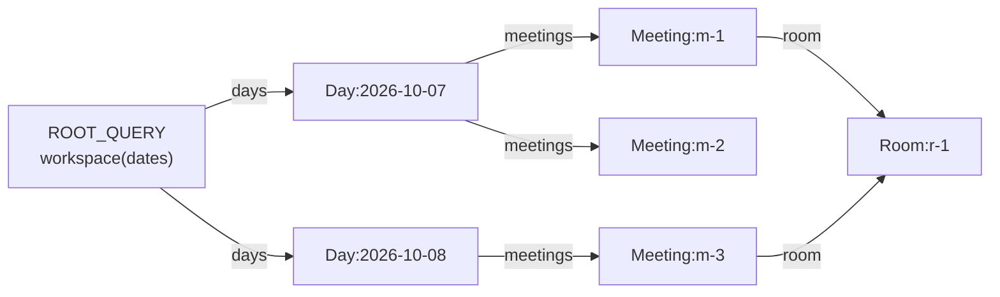
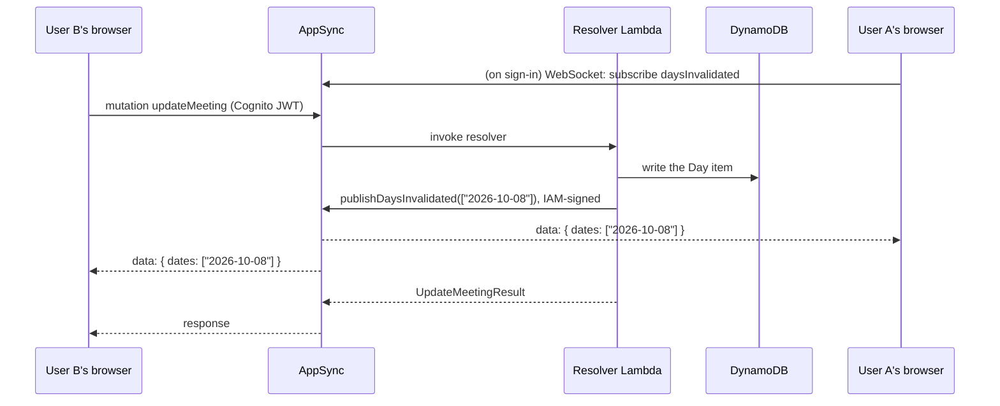
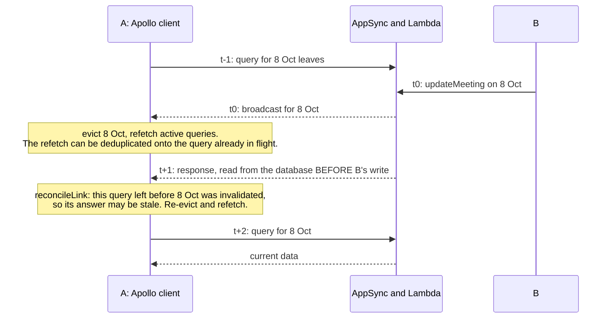
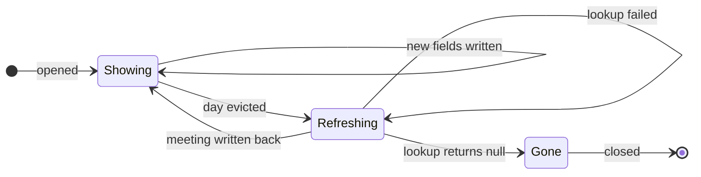
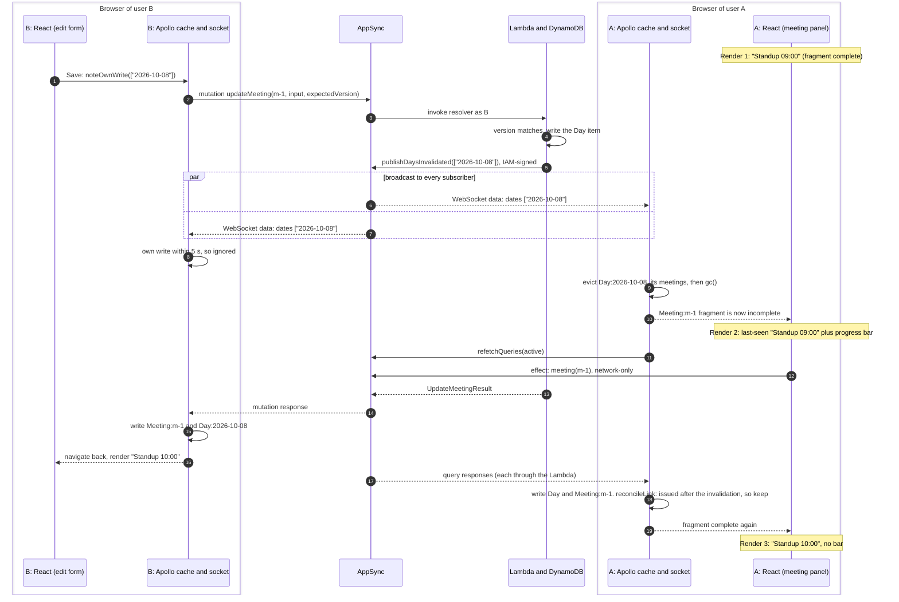
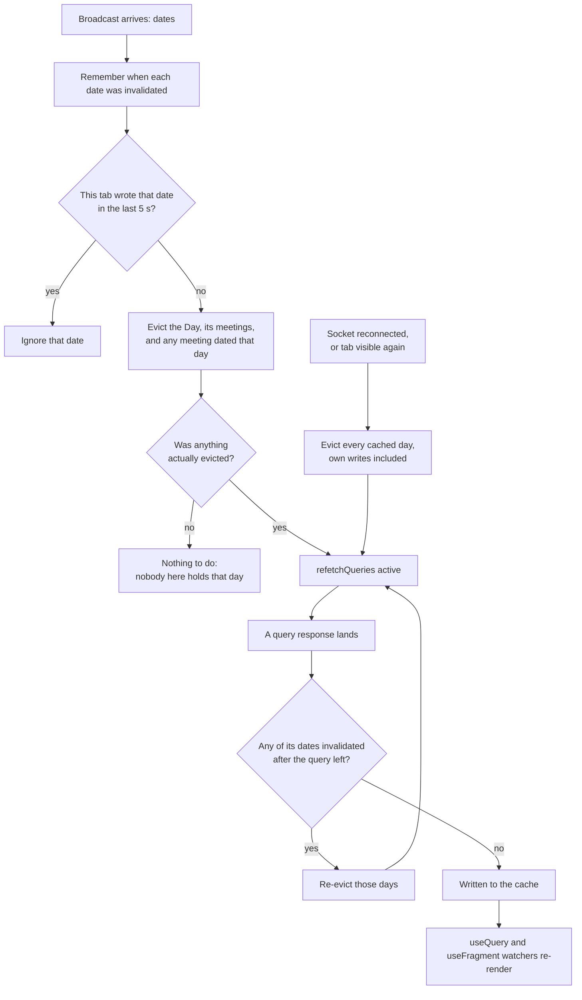
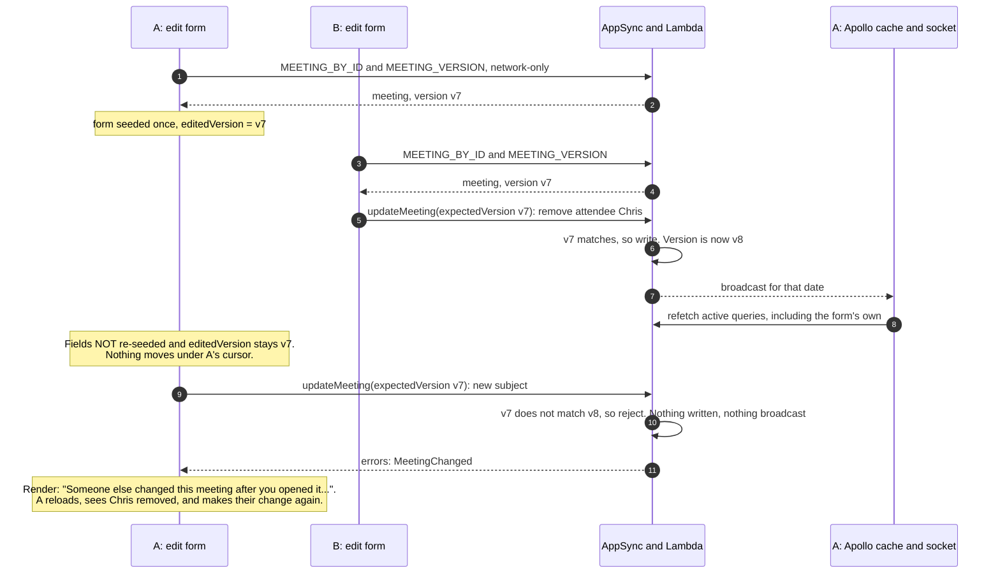

# Live updates in mootmaker, in depth

When one person changes a meeting, everyone else looking at it sees the change within about a
second, without reloading. This write-up explains how, from the WebSocket on the wire to the React
render on the screen. It also explains why each piece is the way it is.

It's the long companion to [the live-updates talk](live-updates-talk.md). The talk has 40 minutes
and has to skim. This has room for every detail, and for **primers** on the technologies involved.

## How to read this

You don't need to read it in order. The primers in Part 1 are there to come back to: skip any whose
subject you already know, and follow the links from later sections when something is unfamiliar.

| If you want… | Read |
|---|---|
| the idea in five minutes | [The short version](#the-short-version), then the diagram in [4.1](#41-b-edits-a-meeting-while-a-is-looking-at-it) |
| to understand the server side | [Part 2](#part-2--the-server-broadcasting-a-change), with [Primer D](#primer-d--graphql-subscriptions-websockets-and-appsync) and [Primer E](#primer-e--authentication-and-authorisation-on-aws) |
| to understand the client side | [Part 3](#part-3--the-client-keeping-the-cache-honest), with [Primer B](#primer-b--react-rendering-and-hooks) and [Primer C](#primer-c--apollo-client-and-its-cache) |
| to work on a page that shows meetings | [Part 4](#part-4--what-the-screen-shows-while-it-catches-up) |
| to know how it's tested | [Part 6](#part-6--how-its-tested) |
| why it isn't done some other way | [Part 7](#part-7--alternatives-and-trade-offs) |

**Contents**

- [The short version](#the-short-version)
- [Part 1 — Primers](#part-1--primers)
  - [A. GraphQL](#primer-a--graphql)
  - [B. React rendering and hooks](#primer-b--react-rendering-and-hooks)
  - [C. Apollo Client and its cache](#primer-c--apollo-client-and-its-cache)
  - [D. GraphQL subscriptions, WebSockets and AppSync](#primer-d--graphql-subscriptions-websockets-and-appsync)
  - [E. Authentication and authorisation on AWS](#primer-e--authentication-and-authorisation-on-aws)
  - [F. Optimistic concurrency](#primer-f--optimistic-concurrency)
- [Part 2 — The server: broadcasting a change](#part-2--the-server-broadcasting-a-change)
- [Part 3 — The client: keeping the cache honest](#part-3--the-client-keeping-the-cache-honest)
- [Part 4 — What the screen shows while it catches up](#part-4--what-the-screen-shows-while-it-catches-up)
- [Part 5 — Walkthroughs](#part-5--walkthroughs)
- [Part 6 — How it's tested](#part-6--how-its-tested)
- [Part 7 — Alternatives and trade-offs](#part-7--alternatives-and-trade-offs)
- [Glossary](#glossary)
- [Further reading](#further-reading)

---

## The short version

1. Every API call that changes meetings, once its write has committed, calls a special mutation,
   `publishDaysInvalidated(dates)`. Only the server can call it: it's locked to AWS IAM.
2. AppSync pushes `{ dates: [...] }` over a WebSocket to every signed-in browser.
3. Each browser **evicts** those days from its Apollo cache and **refetches** whatever is on screen.
   React re-renders from the fresh cache.
4. Broadcasts can be lost, so a browser also throws away everything it holds whenever its socket
   reconnects or its tab comes back to the foreground.
5. While data is being refetched, every screen keeps showing what it last knew, with a progress bar
   over it. It never shows "cancelled" or "no meetings" until the server has confirmed it.

The rest of this document is the detail behind each of those sentences.

---

# Part 1 — Primers

Each primer is self-contained. Skip the ones you know.

## Primer A — GraphQL

**Skip if** you can read a GraphQL schema and query.

GraphQL is an API style where the server publishes a **schema**, a typed description of everything
it can do, and the client sends a **document** saying exactly which fields it wants back. One HTTP
endpoint (`/graphql`) serves everything.

```graphql
# Part of mootmaker's schema (api/mootmaker.graphql), trimmed
type Query {
  workspace(dates: [String!]): Workspace!
  meeting(id: ID!): Meeting
}

type Workspace {
  rooms: [Room!]!
  people: [Person!]!
  days: [Day!]!
}

type Day {
  date: String!
  meetings: [Meeting!]!
}
```

A client asks for the fields it needs, and the response has the same shape:

```graphql
query Days($dates: [String!]) {
  workspace(dates: $dates) {
    days { date meetings { id subject startTime } }
  }
}
```

There are three kinds of operation:

- **query**: read something.
- **mutation**: change something, and get back whatever you select from the result.
- **subscription**: ask once, then receive a message every time something happens. See
  [Primer D](#primer-d--graphql-subscriptions-websockets-and-appsync).

Two details matter later:

- **`__typename`.** Every object in a response can carry its type name. Apollo adds `__typename` to
  every selection automatically, which is how its cache knows that an object is a `Meeting`.
- **Errors as data.** mootmaker's mutations return validation failures as a typed list, for
  example `createMeeting` returns `{ meeting, day, errors: [RoomUnavailable] }`. A rejected booking
  is therefore a *successful* GraphQL response. That turns out to matter for broadcasting
  ([2.2](#22-why-a-dedicated-publish-mutation)).

Further reading: [graphql.org/learn](https://graphql.org/learn/).

---

## Primer B — React rendering and hooks

**Skip if** you're comfortable with `useState`, `useRef` and `useEffect`, and know what causes a
re-render.

A React component is a function that takes **props** (inputs from its parent), reads **state**, and
returns a description of the UI. React calls it, compares the result with what's on screen, and
changes only what differs. That call is a **render**.

A component re-renders when:

- its own state changes (`setState`),
- its parent re-renders and passes new props, or
- a hook it uses tells React that something it depends on has changed. Apollo's hooks do this
  whenever the cache data they're watching changes.

```tsx
function MeetingTitle({ id }: { id: string }) {
  const { data, loading } = useQuery(MEETING_BY_ID, { variables: { id } })
  if (loading && !data) return <Spinner />
  return <h2>{data.meeting.subject}</h2>
}
```

The four hooks this document uses:

| Hook | Holds | Changing it re-renders? | Typical use here |
|---|---|---|---|
| `useState` | a value the UI depends on | **yes** | "has the server confirmed this meeting is gone?" |
| `useRef` | a mutable box that survives renders | **no** | "the last complete version of this meeting I saw" |
| `useEffect` | code to run **after** a render, with an optional cleanup | n/a | "ask the server about this meeting" |
| `useQuery`, `useFragment` (Apollo) | a live view of cache data | **yes**, when that data changes | everything shown on screen |

### Effects, cleanup and stale responses

An effect runs after the render that scheduled it, and runs again whenever one of its dependencies
changes. Before running again, or when the component unmounts, React calls the cleanup function
the effect returned. The standard way to ignore a response that arrives too late:

```tsx
useEffect(() => {
  let active = true
  fetchSomething().then((result) => {
    if (active) setResult(result)    // ignored if the effect has been cleaned up since
  })
  return () => { active = false }    // cleanup: runs before the next effect, or on unmount
}, [dependency])
```

### The mental model this document relies on

In mootmaker, **the UI is a function of the Apollo cache.** Server data almost never goes into
`useState`. Components watch the cache, and anything that changes the cache (a query response, a
mutation response, an eviction) re-renders exactly the components watching that part of it. Live
updates are therefore "change the cache correctly", and React takes care of the screen.

Further reading: [Render and commit](https://react.dev/learn/render-and-commit),
[`useRef`](https://react.dev/reference/react/useRef),
[`useEffect`](https://react.dev/reference/react/useEffect).

---

## Primer C — Apollo Client and its cache

**Skip if** you know what normalisation, `keyFields`, fetch policies, `evict` and `refetchQueries`
are.

[Apollo Client](https://www.apollographql.com/docs/react/caching/overview) sends GraphQL operations
and keeps the results in an in-memory cache, `InMemoryCache`. mootmaker uses Apollo Client 4 with
React 19.

### Links: the request pipeline

Every operation passes through a chain of **links** before reaching the network. mootmaker's chain
is in [apolloClient.ts](https://github.com/geoffweatherall/mootmaker-webapp/blob/main/webapp/src/apolloClient.ts):

```
authLink  →  reconcileLink  →  HttpLink
(adds the     (in-flight race    (sends it to AppSync
 user's JWT)   guard, see 3.6)    over HTTPS)
```

A link sees each operation on its way out and each result on its way back, which makes it the right
place for cross-cutting behaviour.

### Normalisation

Apollo doesn't store "the response to query X". It splits each response into **entities**, stores
each once under a **cache key**, and replaces nested objects with **references**:



- By default the key is `__typename` plus `id`, giving `Meeting:m-1`.
- A type without an `id` needs **`keyFields`**. `Day: { keyFields: ['date'] }` gives each day the
  key `Day:{"date":"2026-10-08"}`, written `Day:2026-10-08` for short in this document. Code never
  builds that string by hand: `cache.identify({ __typename: 'Day', date })` does.
- The same `Meeting:m-1` is shared by every query that returned it. Write it once, from anywhere,
  and every component showing it re-renders.

**Why this matters for live updates:** because a day's key comes from its date, a browser that
hears "8 October changed" can work out the exact cache entry to throw away, without asking the
server.

### Field policies

Type policies can customise how individual fields are read and written. mootmaker uses three,
described in [3.7](#37-the-cache-configuration-that-makes-this-work):

- `keyArgs`: which arguments make a field's cache entry distinct.
- `read`: computes a field's value when it's read from the cache.
- `merge`: combines incoming data with what's already there.

### Complete and incomplete reads

When a component asks for a query, Apollo first tries to answer it **from the cache alone**. If
every requested field is present, the read is **complete**. If anything is missing, it's
**incomplete**, and depending on the fetch policy Apollo goes to the network.

One subtle rule matters a lot later: **if a list contains a reference to an entity that no longer
exists, Apollo silently drops it from the list**, and the read can still be complete. See
[3.3](#33-eviction-alone-doesnt-refetch).

### Reading: `useQuery` and `useFragment`

```tsx
// A whole query. data, loading, and previousData (the last result before this one).
const { data, loading, previousData } = useQuery(PAGE_LOAD, {
  variables: { dates }, fetchPolicy: 'cache-and-network',
})

// ONE entity, live, however it got into the cache. data, and whether it's complete.
const { data, complete } = useFragment({
  fragment: MEETING_LIVE_FIELDS_FRAGMENT,
  from: { __typename: 'Meeting', id: meetingId },
})
```

Both **watch** the cache. When the data they read changes, the component re-renders.

### Fetch policies

| Policy | Reads the cache? | Goes to the network? | mootmaker uses it for |
|---|---|---|---|
| `cache-first` (default) | yes, and stops if complete | only when the cache is incomplete | rooms and people (`REFERENCE_DATA`), the bookable window (`BOUNDARIES`) |
| `cache-and-network` | yes, returns it immediately | **always**, and re-renders with the answer | every meetings query: `PAGE_LOAD`, `DAYS`, `MEETING_BY_ID` |
| `network-only` | no | always, and writes the result to the cache | the edit form, the session, the detail panel's "is it really gone?" lookup |
| `cache-only` / `no-cache` | | | not used |

With `cache-and-network` and a warm cache, a page renders twice: once immediately from the cache,
with `loading: true`, and once when the network answers, with `loading: false`. That's what lets
mootmaker show the last-known content instantly with a slim progress bar over it, then replace it.

### Mutations update the cache by themselves

When a mutation's response includes entities, Apollo normalises them into the cache like any other
response. mootmaker's mutations select the whole affected object back. `createMeeting` returns the
whole `Day`, and `respondToMeeting` returns the whole `Meeting`. So the tab that made a change has
the new state the moment the response arrives, with no `update` functions and no refetch: *the
response is the new state.*

### Invalidating: `evict`, `gc`, `refetchQueries`

| Call | Effect |
|---|---|
| `cache.evict({ id })` | removes an entity. References to it become **dangling** |
| `cache.gc()` | removes entities nothing references any more |
| `client.refetchQueries({ include: 'active' })` | re-runs, over the network, every query a mounted component is watching |

Apollo also **deduplicates** identical queries in flight: if a query is already on its way, asking
again joins the existing request rather than sending a second one. That's normally helpful, but it
matters in [3.6](#36-the-in-flight-race).

Further reading: [Caching overview](https://www.apollographql.com/docs/react/caching/overview),
[queries and fetch policies](https://www.apollographql.com/docs/react/data/queries),
[garbage collection and eviction](https://www.apollographql.com/docs/react/caching/garbage-collection),
[refetching](https://www.apollographql.com/docs/react/data/refetching),
[`useFragment`](https://www.apollographql.com/docs/react/api/react/useFragment).

---

## Primer D — GraphQL subscriptions, WebSockets and AppSync

**Skip if** you know how AppSync subscriptions are triggered and what its WebSocket protocol looks
like.

### WebSockets

HTTP is request and response: the server can only speak when asked. A **WebSocket** starts as an
HTTP request and then *upgrades* into a long-lived, two-way connection, so the server can send
messages whenever it likes. The cost is that the connection must stay open, and connections drop:
laptops sleep, phones suspend background tabs, networks change, and servers close idle sockets.

### GraphQL subscriptions

A subscription is a GraphQL operation that, instead of one response, yields a message each time an
event happens. It is almost always carried over a WebSocket.

### AWS AppSync

[AppSync](https://docs.aws.amazon.com/appsync/latest/devguide/aws-appsync-real-time-data.html) is
AWS's managed GraphQL service. mootmaker's whole API is an AppSync API whose resolvers are a Java
Lambda.

**In AppSync, subscriptions are driven by mutations.** A subscription field has no resolver of its
own. It is declared as *"when this mutation succeeds, push its return value to subscribers"*:

```graphql
type Subscription {
  daysInvalidated: Invalidation @aws_subscribe(mutations: ["publishDaysInvalidated"])
}
```

Consequences:

- The broadcast payload **is** the mutation's return value. The subscription's type must equal the
  mutation's return type.
- There's no server-side "publish" API. **To broadcast, you call a mutation.**

### AppSync's WebSocket protocol

AppSync speaks its own protocol, documented in
[Building a real-time WebSocket client](https://docs.aws.amazon.com/appsync/latest/devguide/real-time-websocket-client.html).
It is negotiated with the subprotocol name `graphql-ws`, but it is **not** the protocol the
`graphql-ws` npm package implements, which is `graphql-transport-ws`. AppSync refuses that outright.

```
connect   wss://<host>/graphql/realtime?header=<base64 auth>&payload=e30=
→ connection_init
← connection_ack   {"connectionTimeoutMs": 300000}
→ start            {id, payload: {data: "<query as a JSON string>", extensions: {authorization}}}
← start_ack                    ← the subscription is live only from here
← ka                           ← keep-alive, about every 60 s
← data             {payload: {data: {daysInvalidated: {dates: [...]}}}}
```

### Facts that shape the design

Measured on a throwaway AppSync API before the design was finalised (recorded in the
[caching design](../../designs/archive/graphql-schema-and-caching.md), "Verified: AppSync
subscription behaviour"):

| Behaviour | Measured |
|---|---|
| Subscription typed differently from its mutation | rejected at deploy, loudly |
| A mutation that returns successfully with validation `errors` | **broadcast exactly like a success** |
| A publish while a subscriber is disconnected | **lost**. There is no replay or buffering |
| Payload over 240 KB | **silently not delivered**, while the publisher sees success |
| A filter with an unsupported operator | **silently matches everything or nothing**, with no error |
| Idle timeout | 300 s, with keep-alives about every 60 s |

The pattern: **AppSync's subscription failures are overwhelmingly silent.** The design therefore
has to make a lost message harmless, not just unlikely.

### Pricing

From the [AppSync pricing page](https://aws.amazon.com/appsync/pricing/): US$4.00 per million
queries and mutations, **US$2.00 per million real-time updates** (each message, to each subscriber,
per 5 KB), and US$0.08 per million connection-minutes.

---

## Primer E — Authentication and authorisation on AWS

**Skip if** you know Cognito user pools, AppSync auth modes and IAM resource ARNs.

**Authentication** is who you are. **Authorisation** is what you may do.

### Cognito user pools and JWTs

mootmaker's users sign in to an **Amazon Cognito user pool**, which issues a signed **JWT** (JSON Web
Token). The webapp sends the ID token in the `Authorization` header of every request. AppSync checks
the signature and expiry. Anyone can sign up, so a valid token proves *who* someone is, not that
they're trusted. mootmaker puts the caller's Person id in the token as `custom:personId`.

### AppSync's authorisation modes

An AppSync API has a **default** authorisation mode and optional **additional** ones. mootmaker's
default is `AMAZON_COGNITO_USER_POOLS`, and it adds `AWS_IAM`.

- A field with **no directive** uses the default mode, so any valid Cognito token can call it.
  Finer checks, like "admins only", happen in the Lambda.
- A directive such as **`@aws_iam`** restricts a field or type to the named mode. A Cognito token
  calling an `@aws_iam`-only field is rejected **before any resolver runs**.
- A *type* that's read by more than one kind of caller has to name every mode that reads it.

### IAM and SigV4

**AWS IAM** is how AWS services and code running in AWS are authorised. The Lambda runs with an
**execution role**. Requests it makes are signed with that role's credentials using **SigV4**, a
signature over the request that AWS verifies. An IAM **policy** lists the actions a role may
perform and the **resources** (ARNs) they may be performed on. For AppSync, the action is
`appsync:GraphQL`, and the resource can be as narrow as a single field:

```
arn:aws:appsync:<region>:<account>:apis/<api-id>/types/Mutation/fields/publishDaysInvalidated
```

Further reading: [AppSync authorisation](https://docs.aws.amazon.com/appsync/latest/devguide/security-authz.html).

---

## Primer F — Optimistic concurrency

**Skip if** you know what a version check or compare-and-swap is.

Two people edit the same record. Both load version 7. The first saves and the record becomes
version 8. The second saves changes made against version 7. Without protection, the second save
**silently overwrites** the first person's changes. That's a *lost update*.

**Optimistic concurrency** assumes conflicts are rare and checks for them at save time: each save
says "I edited version 7", and the server refuses it if the record isn't version 7 any more. The
loser is told, reloads, and tries again. No locks are held while people edit.

mootmaker uses it twice: DynamoDB writes of a whole day are conditional on the day's version, with
retries, and `updateMeeting` takes the meeting's version from the edit form
([4.5](#45-forms-dont-change-underneath-you-and-stale-saves-are-refused)).

---

# Part 2 — The server: broadcasting a change

## 2.1 The shape of it



Meetings are stored **one DynamoDB item per day** (`DAY#<date>`), holding every meeting on that day.
A day is the unit of storage, the unit of caching (`Day:<date>`), and the unit of invalidation. That
alignment is deliberate, and it's why a broadcast can be just a list of dates.

## 2.2 Why a dedicated publish mutation

Since AppSync broadcasts mutations' return values ([Primer D](#primer-d--graphql-subscriptions-websockets-and-appsync)),
the obvious design is to subscribe to the real mutations:
`@aws_subscribe(mutations: ["createMeeting", "updateMeeting", ...])`. It doesn't work:

- **Rejected writes would be broadcast.** A booking refused with `errors: [RoomUnavailable]` is a
  successful response, and AppSync broadcasts it like any other. Every client would refetch for
  bookings that never happened.
- **One subscription can't span different return types.** `createMeeting` returns
  `CreateMeetingResult`, `createMeetings` returns `CreateMeetingsResult`, and so on.
- **It would be too big.** A mutation response can carry a whole `Day`, up to about 618 KB in the
  worst case. The subscription cap is 240 KB, and an oversized message is silently dropped.
- **Filtering doesn't rescue it.** Subscription filters with an unsupported operator silently
  match everything or nothing.

So there's a mutation that exists **only** to be broadcast, called by the server **only** after a
write has committed:

```graphql
"NOT FOR CLIENT USE ... A publish-only mutation on a NONE data source, called by the resolver
Lambda over IAM-signed HTTP after a successful write, purely to drive Subscription.daysInvalidated."
publishDaysInvalidated(dates: [String!]!): Invalidation @aws_iam

"Carries invalidated DATES, never data."
type Invalidation @aws_iam @aws_cognito_user_pools {
  dates: [String!]!
}
```

Its resolver runs no code. It uses a **NONE data source**, and its request template just echoes the
arguments back as the payload:

```hcl
resource "aws_appsync_datasource" "publish" { type = "NONE" }

resource "aws_appsync_resolver" "publish_days_invalidated" {
  request_template  = <<-EOT
    { "version": "2018-05-29", "payload": $util.toJson($context.arguments) }
  EOT
  response_template = "$util.toJson($context.result)"
}
```

`Invalidation` is an object with one field, rather than a bare list of strings, so fields can be
added later (an origin id, or flags for rooms and people) without breaking deployed clients.

## 2.3 Publishing from the handlers

Every handler that changes meetings finishes by publishing the affected dates:

```java
// UpdateMeetingHandler, simplified
if (movingDay) {
  days.moveMeeting(meetingId, currentDate, requestedDate, newRecord);
  broadcaster.publish(List.of(currentDate, requestedDate));   // both days changed
} else {
  days.mutate(requestedDate, day -> /* replace the meeting */);
  broadcaster.publish(List.of(requestedDate));
}
```

- **Only after success.** A rejected write returns before reaching `publish`, so it broadcasts
  nothing.
- **Once per call, not once per meeting.** `createMeetings` creates up to 99 meetings on one date
  and publishes that one date once.
- **Both dates for a move**, because both days changed.

`broadcaster` is a small interface, `DayBroadcaster`, with a do-nothing implementation used wherever
broadcasting isn't configured (the admin tools share the same jar), and a recording implementation
for unit tests. A unit test can then assert exactly which dates a handler broadcast, including
"none" for a rejected write.

## 2.4 The publisher

[DaysInvalidatedPublisher.java](https://github.com/geoffweatherall/mootmaker-api/blob/main/impl/src/main/java/com/mootmaker/realtime/DaysInvalidatedPublisher.java)
makes a SigV4-signed HTTPS POST from the Lambda back to its own AppSync endpoint:

```java
final SignedRequest signed = AwsV4HttpSigner.create().sign(r -> r
    .identity(credentials.resolveCredentials())
    .request(unsigned)
    .payload(() -> new ByteArrayInputStream(body.getBytes(UTF_8)))
    .putProperty(AwsV4HttpSigner.SERVICE_SIGNING_NAME, "appsync")
    .putProperty(AwsV4HttpSigner.REGION_NAME, region.id()));
```

Three deliberate behaviours:

1. **It never throws.** By the time it runs, the write has committed and will be reported to the
   caller as successful. Failing the request because the *notification* failed would turn a missed
   refresh into an apparently lost booking, and at exactly the moment AppSync is unhealthy. A
   failure is logged at WARN, and clients catch up on their next tab return or reconnect.
2. **It has a 2-second timeout.** It runs inside the caller's request, so every millisecond is
   latency the user pays for an update meant for other people.
3. **It doesn't trust HTTP 200.** AppSync reports authorisation failures *inside* a 200 response
   body. The publisher checks the body for `"errors"`, because otherwise a misconfiguration would be
   invisible on both sides.

**Ordering worth knowing:** the publish happens *inside* the request, after the database write and
before the response. The broadcast therefore usually reaches browsers, including the one that made
the change, **before** that browser receives its own response. [3.4](#34-ignoring-your-own-writes)
depends on this.

## 2.5 Who can publish, and who can listen

The threat model: if a user could call `publishDaysInvalidated`, they could make **every connected
browser evict and refetch**, as fast as they liked. One call becomes N refetches across the user
base, plus a real-time message per subscriber on AppSync's bill. Signing in isn't a barrier: anyone
can sign up, and on mootmaker's API **every valid token can reach every unannotated field**. Admin
checks live in the Lambda.

The layers:

| Layer | Configured in | What it stops |
|---|---|---|
| A Cognito JWT is needed for everything, including opening the WebSocket and subscribing | `appsync.tf`: `authentication_type = "AMAZON_COGNITO_USER_POOLS"` | anonymous visitors listening or calling anything |
| `@aws_iam` on `publishDaysInvalidated` | the schema | any user token calling it. AppSync refuses before any resolver runs |
| The Lambda's IAM grant names **one field** | `iam.tf`: `…/types/Mutation/fields/publishDaysInvalidated` | the server's own credentials being usable for anything else on the API |
| Dates only in the payload | the schema | a listener learning anything beyond "something changed on this date" |

```hcl
# appsync.tf
authentication_type = "AMAZON_COGNITO_USER_POOLS"
user_pool_config { default_action = "ALLOW" }        # the only legal value with additional providers
additional_authentication_provider {
  authentication_type = "AWS_IAM"
}

# iam.tf
statement {
  actions   = ["appsync:GraphQL"]
  resources = ["${aws_appsync_graphql_api.this.arn}/types/Mutation/fields/publishDaysInvalidated"]
}
```

The schema directive and the IAM grant are **two independent locks**, and the design trusts neither
alone.

Two configuration details fail **silently** if wrong, so they carry comments in the code:

- `Invalidation` needs **both** `@aws_iam` and `@aws_cognito_user_pools`. It's written by an IAM
  caller (the Lambda) and read by Cognito users (subscribers). With only one, subscribing succeeds
  and nothing is ever delivered. The only symptom is "Not Authorized to access dates on type
  Invalidation" in the publisher's 200 response.
- `default_action` must stay `ALLOW`. It looks tightenable to `DENY`, but AppSync refuses `DENY`
  when additional providers exist.

**Privacy.** Every broadcast reaches every signed-in client. That's acceptable because every
signed-in user can already read every meeting, and the broadcast carries only dates. The
[open questions](live-updates-open-questions.md#2-is-it-ok-that-every-signed-in-client-receives-every-broadcast)
document looks at when this would need partitioning.

## 2.6 Why dates, not data

- **Always tiny.** The largest possible broadcast, every day in the 217-day window, measured
  2,861 bytes on the wire: about 1.2% of the 240 KB cap.
- **One channel for every kind of change.** Create, bulk create, edit, move, cancel and RSVP all
  produce the same message.
- **Idempotent.** "8 October changed", received twice, is harmless. "Add meeting m-9", received
  twice, would need de-duplication.
- **No merging and no ordering.** The client never applies a change. It discards its copy and asks
  again, so two broadcasts arriving out of order can't corrupt anything.

The cost: a broadcast always causes a refetch in each client holding that day, rather than
carrying the answer itself. At mootmaker's scale that's a non-issue, and
[Part 7](#part-7--alternatives-and-trade-offs) discusses it further.

---

# Part 3 — The client: keeping the cache honest

## 3.1 The socket

[appsyncSocket.ts](https://github.com/geoffweatherall/mootmaker-webapp/blob/main/webapp/src/realtime/appsyncSocket.ts)
is a hand-written client for AppSync's protocol, about 100 lines. It isn't a library, because
AppSync refuses the protocol that Apollo's `GraphQLWsLink` and similar libraries speak
([Primer D](#primer-d--graphql-subscriptions-websockets-and-appsync)). It isn't an Apollo link
either, because no component ever renders the subscription. Its only job is to tell the cache what
to throw away.

Details worth knowing:

- **The realtime URL depends on the host.** On mootmaker's custom domain it's
  `wss://<domain>/graphql/realtime`. On the raw AppSync host it's
  `wss://<id>.appsync-realtime-api.<region>.amazonaws.com/graphql`. The wrong one doesn't degrade:
  the socket never connects, and the app looks healthy while receiving nothing. Both are pinned by
  tests.
- **Auth goes in a base64 query parameter**, `header={host, Authorization}`, and again in the
  `start` message's `extensions.authorization`.
- **The token is fetched per connection**, never cached, because a reconnect after a long sleep
  needs a fresh one.
- **Reconnects back off exponentially**, from 1 s doubling to 30 s, and reset once a subscription
  is live again.
- **"Live" means `start_ack`, not `connection_ack`.** Anything published between `start` and
  `start_ack` isn't delivered, so the resync after a reconnect runs at `start_ack`.

## 3.2 One subscription, above the router

[useDaysInvalidated.ts](https://github.com/geoffweatherall/mootmaker-webapp/blob/main/webapp/src/realtime/useDaysInvalidated.ts)
opens the socket once per signed-in session, from `App.tsx`:

```tsx
useDaysInvalidated(Boolean(email))
```

It's mounted above the router, not per page. A per-page subscription would reconnect on every
navigation, and days cached for other screens would silently stop being maintained.

On each message:

```ts
onData: (payload) => {
  const dates = payload.data?.daysInvalidated?.dates
  if (!dates?.length) return
  const evicted = dayInvalidations.invalidate(dates)
  if (evicted.length > 0) void apolloClient.refetchQueries({ include: 'active' })
},
```

`dayInvalidations` is a single `DayInvalidations` instance bound to the app's one cache
([daysInvalidated.ts](https://github.com/geoffweatherall/mootmaker-webapp/blob/main/webapp/src/realtime/daysInvalidated.ts)).
Invalidating a date evicts three things:

1. **Every `Meeting` the day references**, before the day itself. Evicting only the `Day` would
   leave each `Meeting` entity intact, and Apollo's `gc()` doesn't reliably collect an entity that
   a `useFragment` is still watching. An open panel would then keep showing a cancelled meeting as
   if nothing had happened.
2. **The `Day`**, located with `cache.identify`, never with a hand-built key string.
3. **Every cached `Meeting` whose start falls on that date**, wherever it came from. The pop-out
   meeting page holds its meeting through `meeting(id)`, with no `Day` around it at all
   ([4.4](#44-a-meeting-held-without-its-day)).

Then `cache.gc()` tidies up. A broadcast for a day this client never fetched evicts nothing and
triggers nothing. **That's intended:** the day will be fetched fresh if anyone navigates to it.

## 3.3 Eviction alone doesn't refetch

It would be natural to expect that evicting a day a query is showing makes Apollo notice the gap
and fetch it. It doesn't:

```ts
cache.evict({ id: cache.identify({ __typename: 'Day', date: '2026-09-14' }) })
cache.diff({ query: WORKSPACE, variables: { dates: ['2026-09-14'] }, returnPartialData: true })
// → complete: true, result: { workspace: { days: [] } }
```

The query's `days` list still holds a reference to the evicted day, and Apollo **filters dangling
references out of lists** when reading. So the read is *complete, with one day fewer*. A complete
read gives Apollo no reason to fetch, and the screen would show "no meetings" indefinitely.

That's why `useDaysInvalidated` explicitly refetches active queries after an eviction that removed
something. A unit test in `daysInvalidated.test.ts` pins this Apollo behaviour, and its comment
says what to do if it ever changes: if a future Apollo makes that read incomplete, the test fails,
and the explicit refetch can be removed rather than lingering unexplained.

## 3.4 Ignoring your own writes

The tab that saves a change is also a subscriber, so its own broadcast comes back to it. Acting on
it would evict the very data its own mutation response is writing (the authoritative new state),
and refetch it for nothing, with a progress bar on the user's own screen while that happens.

So `DayInvalidations` keeps a short memory of this tab's own writes:

```ts
// AddMeetingPage.tsx, simplified: before the request is sent
dayInvalidations.noteOwnWrite(isEdit ? [originalDate, requestedDate] : [requestedDate])
const result = await updateMeeting({ variables: { … } })
```

For **5 seconds** after `noteOwnWrite`, broadcasts for those dates are ignored. Every meeting
mutation does this: create, edit (both dates, in case it moved), cancel, and respond.

**Why before the request, not after the response:** the server broadcasts *before* it responds
([2.4](#24-the-publisher)), so the broadcast can arrive first. A note made on the response would
already be too late.

**The trade-off, stated:** a genuine change by someone else to the same date, inside those 5
seconds, is ignored too, and this tab stays stale until the next broadcast, tab return or
reconnect. The alternative was a wasted refetch on every save. The
[open questions](live-updates-open-questions.md#1-is-5-seconds-the-right-own-write-window)
document discusses replacing the window with an exact origin id.

## 3.5 Never trust the socket

Broadcasts are lost whenever the socket isn't connected, and AppSync never replays them. So two
events make a tab discard **everything** it holds:

```ts
// A reconnect: the subscription is live again after a drop.
onResubscribed: () => {
  dayInvalidations.invalidateEverything()
  void apolloClient.refetchQueries({ include: 'active' })
},

// The tab coming back to the foreground. A frozen background tab may still hold a socket that
// looks open but delivered nothing, so this doesn't wait for a close event.
document.addEventListener('visibilitychange', () => {
  if (document.visibilityState !== 'visible') return
  dayInvalidations.invalidateEverything()
  void apolloClient.refetchQueries({ include: 'active' })
})
```

The client never works out *what* it missed. It only stops trusting what it holds. No sequence
numbers, no replay requests. `invalidateEverything` deliberately ignores the own-write memory: while
the socket was down, a date this tab wrote may *also* have been changed by someone else.

**Correctness never depends on the WebSocket staying up.** The broadcast makes updates fast. The
resync makes them reliable.

## 3.6 The in-flight race

A query can already be on its way when a broadcast arrives:



Without the last step, A would write pre-change data into the cache *after* the eviction, and
nothing would be left to trigger another fetch. Apollo's deduplication makes this likely rather
than theoretical: the refetch issued in response to the broadcast can be answered by the request
that left before it.

[reconcileLink.ts](https://github.com/geoffweatherall/mootmaker-webapp/blob/main/webapp/src/realtime/reconcileLink.ts)
closes it:

```ts
export function reconcileLink(invalidations, onReEvicted, now = Date.now): ApolloLink {
  return new ApolloLink((operation, forward) => {
    if (operation.operationType !== OperationTypeNode.QUERY) return forward(operation)
    const issuedAt = now()                       // when the request leaves
    return new Observable((observer) => {
      const subscription = forward(operation).subscribe({
        next: (result) => {
          observer.next(result)                  // Apollo writes the result to the cache here
          const dates = datesIn(result.data)     // every Day.date and Meeting.startTime date
          if (dates.length === 0) return
          setTimeout(() => {                     // after the write, never before it
            if (invalidations.reconcileAfterFetch(dates, issuedAt).length > 0) onReEvicted()
          }, 0)
        },
        error: (error) => observer.error(error),
        complete: () => observer.complete(),
      })
      return () => subscription.unsubscribe()
    })
  })
}
```

- `DayInvalidations` records when each date was last invalidated. `reconcileAfterFetch` re-evicts
  any date in the response that was invalidated **after** the request left.
- `onReEvicted` refetches active queries, because of [3.3](#33-eviction-alone-doesnt-refetch).
- **Mutations are excluded.** A mutation response is this tab's own write: the most authoritative
  data there is.
- **It terminates.** Each refetch leaves after the invalidation that caused it, so it isn't
  re-evicted unless *another* change arrives meanwhile.

The test for this drives a real `ApolloClient` through a link that holds responses until the test
releases them, so the broadcast genuinely lands mid-flight. It fails if reconciling is skipped, if
it runs before Apollo's cache write instead of after, or if mutations are included.

## 3.7 The cache configuration that makes this work

Three type policies in [apolloClient.ts](https://github.com/geoffweatherall/mootmaker-webapp/blob/main/webapp/src/apolloClient.ts),
each with a comment explaining why:

```ts
new InMemoryCache({
  typePolicies: {
    Day: { keyFields: ['date'] },
    Workspace: { keyFields: false, fields: { days: { merge: false } } },
    Query: {
      fields: {
        workspace: {
          keyArgs: false,
          read(existing, { args, toReference, canRead }) {
            const dates = args?.dates
            if (!dates) return existing
            const days = dates.map((date) => toReference({ __typename: 'Day', date }))
            if (!days.some((day) => canRead(day))) {
              const { days: _unknown, ...rest } = existing ?? {}
              return rest                        // nothing known: days is MISSING, not empty
            }
            return { ...existing, days }
          },
          merge: (existing, incoming) => ({ ...existing, ...incoming }),
        },
      },
    },
  },
})
```

- **`Day` keyed by date** gives every page the same day entity, and lets a client compute the key
  from a date alone.
- **`workspace` with `keyArgs: false`** means one cache slot, not one per distinct `dates` array.
  Without it, every navigation would create a new slot, caching the same rooms and people again,
  and the app would quietly refetch everything on every week change.
- **The `read` policy rebuilds `days` from the requested dates** every time, as references to
  `Day` entities. Overlapping windows (this week, and Home's today-and-tomorrow) are served from the
  same entities, and a day not yet fetched simply has no data.
- **"Missing" is kept distinct from "empty".** A `Day` present with no meetings means "genuinely
  empty". A `Day` absent means "nobody has looked". When none of the requested days is known, the
  policy omits `days` entirely rather than returning `[]`, so the read is *incomplete* (go to the
  network) rather than "complete and empty" (show "No meetings").

---

# Part 4 — What the screen shows while it catches up

Everything in Part 3 makes the cache *eventually* right. This part is about the gap: the second or
so between "the cache stopped trusting this" and "the new data has arrived". The user is looking at
the screen during that gap.

## 4.1 The rules

From the webapp's
[Progress indicators](https://github.com/geoffweatherall/mootmaker-webapp/blob/main/README.md#progress-indicators)
convention:

1. **A first load with nothing to show:** a centred spinner.
2. **A refresh with something already on screen:** keep showing it, with a slim progress bar above.
3. **Confident negative statements** ("No meetings today", "This meeting was cancelled.") **only
   once settled.** A stale cached "zero" isn't known to be right until the refresh confirms it.

In code, that's three states, not two:

```tsx
const unknown    = loading && data === undefined   // spinner
const refreshing = loading && data !== undefined   // last-known content + progress bar
const settled    = !loading                        // empty-state copy allowed
```

## 4.2 The meeting panel: missing is not cancelled

The meeting detail panel ([MeetingDetailContent.tsx](https://github.com/geoffweatherall/mootmaker-webapp/blob/main/webapp/src/components/MeetingDetailContent.tsx))
is the one place a meeting's details are rendered. It's used both by the side panel or bottom
sheet and by the pop-out page. It watches its meeting with `useFragment`, so any write to
`Meeting:<id>` re-renders it.

When the meeting's day is evicted, the fragment goes **incomplete**. The tempting reading is "it was
deleted":

```tsx
// Tempting, and wrong
if (wasEverComplete && !complete) return <EmptyState message="This meeting was cancelled." />
```

But the fragment goes incomplete on **every** eviction of its day:

- an edit to *any* meeting that day, by anyone,
- an RSVP,
- a tab return or a reconnect ([3.5](#35-never-trust-the-socket)),
- the meeting moving to a day this tab isn't watching. That's permanent, because the new day is never
  fetched.

Only the server knows whether it's really gone. So the panel asks it (slightly simplified):

```tsx
const { data: live, complete } = useFragment({
  fragment: MEETING_LIVE_FIELDS_FRAGMENT,
  from: { __typename: 'Meeting', id: meeting.id },
})

// "It WAS complete and now isn't", as opposed to "not resolved yet" on first mount.
// A ref: this must never itself trigger a render.
const wasEverComplete = useRef(false)
if (complete) wasEverComplete.current = true
const missing = wasEverComplete.current && !complete

// The meeting as last seen complete: what stays on screen while it's missing.
const lastSeen = useRef<MeetingDetails | null>(null)
if (complete && live) lastSeen.current = { id: meeting.id, ...live }

const client = useApolloClient()
const [confirmedGone, setConfirmedGone] = useState(false)
useEffect(() => {
  if (!missing) {
    setConfirmedGone(false)
    return
  }
  let active = true
  client
    .query({ query: MEETING_BY_ID, variables: { id: meeting.id }, fetchPolicy: 'network-only' })
    .then(({ data }) => {
      if (active && !data?.meeting) setConfirmedGone(true)
    })
    .catch(() => {
      // Stay "refreshing": the next broadcast, tab return or reconnect asks again.
    })
  return () => {
    active = false
  }
}, [missing, client, meeting.id])

const cancelledElsewhere = missing && confirmedGone
const refreshing = missing && !confirmedGone
const current = lastSeen.current ?? meeting     // meeting: the snapshot it was opened with
```

How the pieces fit:

- **`network-only` writes its result to the cache.** If the meeting exists, possibly on a new date,
  writing it makes the fragment complete again, and the panel re-renders with the current details.
  A moved meeting needs no special case.
- **`null` means gone**: cancelled, or aged out of retention. Only then does the panel say
  "This meeting was cancelled."
- **While waiting**, the last-seen meeting stays up under a `LinearProgress`, held at a fixed
  height so the content doesn't jump.
- **Refs for memory, state for decisions.** `wasEverComplete` and `lastSeen` must not cause renders.
  `confirmedGone` is what the screen depends on.
- **The `active` flag** discards a lookup that answers after the meeting has already come back.

A note for experienced React developers: writing refs during render is discouraged in general,
because concurrent rendering may discard a render. It's tolerable here because the value written is
always genuine cache data, but it's a reasonable thing to question in review.

The panel's states:



| State | On screen | Gets here when |
|---|---|---|
| **Showing** | the meeting, from its live fragment | opened from a row (shows the row's snapshot until the fragment resolves), or an edit or RSVP is written to the cache |
| **Refreshing** | the last-seen meeting **plus a progress bar** | its day is evicted, so it asks `meeting(id)` with `network-only`. A failed lookup stays here and asks again next time |
| **Gone** | "This meeting was cancelled." | the lookup returned `null` |

## 4.3 Multi-day lists keep a day while it reloads

Home (today, tomorrow and the day after) and Person Calendar (a week) each read several days through
one query. After an eviction, that query reads back *complete, minus the evicted day*
([3.3](#33-eviction-alone-doesnt-refetch)). Rendered directly, that day's meetings would vanish for
a second or two, along with Home's "Needs your response" cards, then reappear.

[keepDaysWhileRefreshing.ts](https://github.com/geoffweatherall/mootmaker-webapp/blob/main/webapp/src/graphql/keepDaysWhileRefreshing.ts)
applies rule 2 per day:

```ts
export function keepDaysWhileRefreshing(data, previousData, loading, requestedDates) {
  if (!loading || !data || !previousData) return data          // settled: trust the server
  const present = new Set(data.workspace.days.map((day) => day.date))
  const requested = new Set(requestedDates)
  const kept = previousData.workspace.days
    .filter((day) => requested.has(day.date) && !present.has(day.date))
  if (kept.length === 0) return data
  return { ...data, workspace: { ...data.workspace, days: [...data.workspace.days, ...kept] } }
}

// HomePage.tsx
const { data: pageData, previousData, loading } = useQuery(PAGE_LOAD, {
  variables: { dates: agendaDates }, fetchPolicy: 'cache-and-network',
})
const data = keepDaysWhileRefreshing(pageData, previousData, loading, agendaDates)
```

While loading, a requested day missing from `data` is kept from `previousData`. Once loading
settles, `data` is used as it is, because it then holds every requested day the server has.

**Room Availability doesn't need this.** It reads a single day. When that only day is missing, the
`read` policy reports `days` as *missing* rather than empty
([3.7](#37-the-cache-configuration-that-makes-this-work)). The read is then incomplete, not
"complete and empty".

## 4.4 A meeting held without its day

The pop-out page, `/meetings/:id`, is usually opened cold from a shared link. It reads the meeting
through `meeting(id)` and holds **no `Day`**. That's why invalidation also evicts meetings by date
([3.2](#32-one-subscription-above-the-router)). The pop-out page then behaves exactly like the panel:
missing, ask, then refresh or confirm gone. Both render the same component, so they *behave* alike,
not just look alike.

## 4.5 Forms don't change underneath you, and stale saves are refused

The edit form is different on purpose. **It never re-fills its fields from a refetch**: a form that
changes while someone is typing loses their input and their place. A broadcast still refreshes the
cache behind it, but the form keeps what the user is editing.

That leaves the lost-update problem ([Primer F](#primer-f--optimistic-concurrency)): saving a form
opened before someone else's change would undo it. So:

- `Meeting.version` is an opaque string that changes whenever anything `updateMeeting` can change
  does. It doesn't change when someone RSVPs, because responses aren't part of the form.
- The form fetches it with the meeting (`MEETING_VERSION`, `network-only`) and **holds it from the
  moment the form is filled, never refreshing it**. It must be the version the edits were made
  against, not whatever a later refetch returns.
- `updateMeeting` sends it as `expectedVersion`. The API compares it twice: once up front, and again
  inside the read-modify-write of the day, so a change landing between the two is still caught.
- A mismatch is rejected with `MeetingChanged`: nothing written, nothing broadcast. The user sees
  "Someone else changed this meeting after you opened it, so your changes were not saved. Reload the
  page to see their changes, then make yours again."

`expectedVersion` is optional in the schema, and omitting it overwrites unconditionally. That let
the API deploy before the webapp started sending it.

---

# Part 5 — Walkthroughs

## 5.1 B edits a meeting while A is looking at it

A has meeting `m-1` ("Standup", 8 October) open in the side panel. B is in the edit form and changes
the start time from 09:00 to 10:00.



Render by render, on A's screen:

| Render | Triggered by (step) | A sees |
|---|---|---|
| 1 | the panel opening | Standup, 09:00 |
| 2 | the fragment going incomplete (10) | Standup, 09:00, with a progress bar |
| 3 | the refetch or the lookup writing `Meeting:m-1` (18, 19) | Standup, 10:00 |

At no point does A see anything false. B sees the new time as soon as their own response arrives
(step 16), with no refetch at all.

## 5.2 What a tab does with each trigger



## 5.3 A and B both editing the same meeting



(`v7` and `v8` are illustrative. Real versions are opaque strings.)

## 5.4 What each kind of change sends

| Change | Dates broadcast | The changing tab's own cache |
|---|---|---|
| `createMeeting` | the meeting's date | the response's `Day` replaces the cached day |
| `createMeetings` (bulk, one date) | that date, **once** | the response's `Day` |
| `updateMeeting`, same day | that date | the response's `Meeting` |
| `updateMeeting`, moved | **both** dates | the response's `Meeting` |
| `cancelMeeting` | the meeting's date | the response's `Day` |
| `respondToMeeting` | the meeting's date | the response's `Meeting` |
| any of the above, rejected | **nothing** | unchanged, and errors shown |

---

# Part 6 — How it's tested

mootmaker treats a green run against a real deployment as the definition of working, and live
updates show why. Several of the behaviours above are properties of Apollo or AppSync, not of
mootmaker's code, so they're only proven where those systems are real.

## 6.1 Unit tests

- **`daysInvalidated.test.ts`** covers which days and meetings an invalidation evicts, the
  own-write window (with a fake clock), the race marker, "a day nobody holds is a no-op", and
  "after a gap, evict everything, including own writes". It also **pins the Apollo behaviour from
  3.3**, with a comment saying what to do if it changes.
- **`reconcileLink.test.ts`** drives a **real `ApolloClient`** through a link that holds responses
  until the test releases them, so the broadcast genuinely lands mid-flight.
- **`appsyncSocket.test.ts`** pins the realtime URL for both kinds of host.
- On the API, handler tests use a recording `DayBroadcaster` to assert **exactly** which dates were
  published, and that a rejected write publishes **nothing**.

## 6.2 Mocked integration tests

The Playwright suite under `webapp/tests/` runs the real app against a mocked API (MSW). There's no
real AppSync there, so it can't test a broadcast. The same eviction-and-refetch path runs on a tab
return, though, so tests simulate `visibilitychange` to prove, for example, that an open panel
survives a refetch of everything on the page.

## 6.3 Acceptance tests against a real deployment

`acceptance/tests/live-updates.spec.ts` runs against a freshly deployed environment with two real
users:

1. User A signs in and opens every view of one meeting, each in its own tab: the panel (opened
   from Room Availability), the pop-out page, Person Calendar and Home. A **recorder** is injected
   before any app code runs.
2. Something triggers a refresh: user B changes the meeting over the API, user B uses a second
   browser where B's own screen is part of the story, or A just switches tabs away and back.
3. Three assertions:
   - **no painted transient** of any negative phrase ("This meeting was cancelled.", "No meetings",
     "Free all day", "Nothing waiting on a response", …) that was true neither before nor after,
   - **the watched content never disappears** on the way,
   - **the end state is right.**

The [recorder](https://github.com/geoffweatherall/mootmaker-webapp/blob/main/acceptance/tests/support/liveRecorder.ts)
samples the page's visible text on **every animation frame**, so if a state was recorded it was on
screen to within a frame. It also samples on every DOM mutation, and logs every AppSync WebSocket
message so a broadcast's arrival can be lined up against what the page did next.

Why this matters: a conventional assertion such as `expect(title).toHaveText('Standup 10:00')`, with
a timeout, **polls until it's true**. It can't see something false that was on screen for a second
along the way, and for live updates the way is where the risk lives.

## 6.4 Proving silence on the API side

The API's own acceptance tests subscribe with a hand-written Java AppSync client, and assert in
both directions: a booking broadcasts, **and** a rejected booking broadcasts nothing, **and** a
bulk create of four meetings broadcasts once. A test that only checked "the broadcast I expected arrived"
would pass against an implementation that broadcast everything. Proving that nothing arrived needs
its own helper, `receivedNothingWithin`, since there's no event to wait for. The client's
`awaitReady()` waits for `start_ack`, because a publish between `start` and `start_ack` is genuinely
lost.

---

# Part 7 — Alternatives and trade-offs

| Alternative | Why not |
|---|---|
| **Polling** (refetch every N seconds) | Latency is N seconds, and cost is proportional to clients × time, whether or not anything changed. Subscriptions cost per change, not per second |
| **Server-sent events from a Lambda** | Lambda is billed for wall-clock time while a connection is held: about US$70/month for ten users on an eight-hour day, against fractions of a cent for AppSync connection-minutes |
| **API Gateway WebSockets** | No idle billing, but it means building the connection registry, fan-out and auth that AppSync already provides |
| **Subscribing to the real mutations** | Broadcasts rejected writes, can't span return types, and the payload can exceed the cap. See [2.2](#22-why-a-dedicated-publish-mutation) |
| **Broadcasting the changed data** | Doesn't fit the 240 KB cap for a full day, needs merging and de-duplication, and makes message order matter. Dates are tiny, idempotent and order-free |
| **Filtering subscriptions per date or per user** | Filters with unsupported operators fail silently. Per-date subscriptions churn as users navigate. Every user can see every meeting anyway |
| **Apollo's subscription link (`GraphQLWsLink`)** | AppSync refuses its protocol. Also, nothing renders the subscription, so a link would add lifecycle for no benefit |
| **One subscription per page** | Reconnects on every navigation, and days cached for other pages would stop being maintained |
| **Trusting the socket** | No replay means any gap loses messages silently. Resyncing on reconnect and tab return is what makes it correct |

Open questions, such as the 5-second window, broadcasting to everyone, the breadth of
`refetchQueries`, and rooms and people, are discussed with suggested answers in
[live-updates-open-questions.md](live-updates-open-questions.md).

---

## Glossary

| Term | Meaning here |
|---|---|
| **AppSync** | AWS's managed GraphQL service, which hosts mootmaker's API |
| **Broadcast** | One `daysInvalidated` message: a list of dates, pushed to every subscriber |
| **Cache key** | The id Apollo stores an entity under, such as `Meeting:m-1` or `Day:{"date":"2026-10-08"}` |
| **Complete / incomplete** | Whether Apollo can answer a read entirely from the cache |
| **Dangling reference** | A reference to an evicted entity. Apollo drops these from lists when reading |
| **Evict** | Remove an entity from Apollo's cache |
| **Fetch policy** | Per query, how Apollo balances the cache against the network |
| **Fragment** | A reusable selection of fields on one type. `useFragment` watches one entity through it |
| **IAM** | AWS's permission system. The Lambda's role may call one field |
| **Invalidation** | Telling the cache to stop trusting something, here by evicting it |
| **NONE data source** | An AppSync resolver with no backing service: it returns what it's given |
| **Normalised cache** | A cache that stores each entity once, by key, with references between them |
| **Own write** | A change made by this tab, whose broadcast this tab ignores for 5 s |
| **Resync** | Evicting everything after a reconnect or tab return |
| **SigV4** | AWS's request-signing scheme |
| **Transient** | Something shown on screen that was true neither before nor after a change |

## Further reading

**In this repository and its siblings**

- [graphql-schema-and-caching.md](../../designs/archive/graphql-schema-and-caching.md): the design
  behind the day-keyed schema, the cache, and subscriptions, including every measurement quoted here.
- [edit-and-cancel-meetings.md](../../designs/archive/edit-and-cancel-meetings.md): why meetings are
  evicted along with their day (Decision 10).
- [live-updates-open-questions.md](live-updates-open-questions.md): suggested answers to the open
  questions.
- The webapp README's [Progress indicators](https://github.com/geoffweatherall/mootmaker-webapp/blob/main/README.md#progress-indicators)
  section.
- Code: [appsyncSocket.ts](https://github.com/geoffweatherall/mootmaker-webapp/blob/main/webapp/src/realtime/appsyncSocket.ts),
  [daysInvalidated.ts](https://github.com/geoffweatherall/mootmaker-webapp/blob/main/webapp/src/realtime/daysInvalidated.ts),
  [useDaysInvalidated.ts](https://github.com/geoffweatherall/mootmaker-webapp/blob/main/webapp/src/realtime/useDaysInvalidated.ts),
  [reconcileLink.ts](https://github.com/geoffweatherall/mootmaker-webapp/blob/main/webapp/src/realtime/reconcileLink.ts),
  [apolloClient.ts](https://github.com/geoffweatherall/mootmaker-webapp/blob/main/webapp/src/apolloClient.ts),
  [MeetingDetailContent.tsx](https://github.com/geoffweatherall/mootmaker-webapp/blob/main/webapp/src/components/MeetingDetailContent.tsx),
  [keepDaysWhileRefreshing.ts](https://github.com/geoffweatherall/mootmaker-webapp/blob/main/webapp/src/graphql/keepDaysWhileRefreshing.ts),
  [mootmaker.graphql](https://github.com/geoffweatherall/mootmaker-api/blob/main/api/mootmaker.graphql),
  [DaysInvalidatedPublisher.java](https://github.com/geoffweatherall/mootmaker-api/blob/main/impl/src/main/java/com/mootmaker/realtime/DaysInvalidatedPublisher.java),
  [appsync.tf](https://github.com/geoffweatherall/mootmaker-api/blob/main/deploy/terraform/appsync.tf),
  [iam.tf](https://github.com/geoffweatherall/mootmaker-api/blob/main/deploy/terraform/iam.tf),
  [live-updates.spec.ts](https://github.com/geoffweatherall/mootmaker-webapp/blob/main/acceptance/tests/live-updates.spec.ts).

**External**

- React: [Render and commit](https://react.dev/learn/render-and-commit),
  [`useRef`](https://react.dev/reference/react/useRef),
  [`useEffect`](https://react.dev/reference/react/useEffect)
- Apollo Client: [caching overview](https://www.apollographql.com/docs/react/caching/overview),
  [queries and fetch policies](https://www.apollographql.com/docs/react/data/queries),
  [eviction and garbage collection](https://www.apollographql.com/docs/react/caching/garbage-collection),
  [refetching](https://www.apollographql.com/docs/react/data/refetching),
  [`useFragment`](https://www.apollographql.com/docs/react/api/react/useFragment)
- AppSync: [real-time data](https://docs.aws.amazon.com/appsync/latest/devguide/aws-appsync-real-time-data.html),
  [the WebSocket protocol](https://docs.aws.amazon.com/appsync/latest/devguide/real-time-websocket-client.html),
  [authorisation](https://docs.aws.amazon.com/appsync/latest/devguide/security-authz.html),
  [pricing](https://aws.amazon.com/appsync/pricing/)
- GraphQL: [graphql.org/learn](https://graphql.org/learn/)
