# Live updates in the webapp — the short version

How one user's change reaches another user's screen without a reload, and why the screen never shows
anything false along the way. A shorter, higher-level cut of [the full talk](live-updates-talk.md),
for an audience that has never seen Mootmaker.

Slides are separated by horizontal rules. Speaker notes are the quoted blocks. Diagrams are Mermaid.

---

## 1. What is Mootmaker

A meeting room booking system, running as a public demo at [www.mootmaker.com](https://www.mootmaker.com).

- **Book a room** on one form: subject, organiser, attendees, date, time, room.
- **See what's free**: every room side by side for a day.
- **See anyone's calendar**: a week at a time, everything a person organises or attends.

**Home**: your meetings today and tomorrow, and anything waiting on your response.

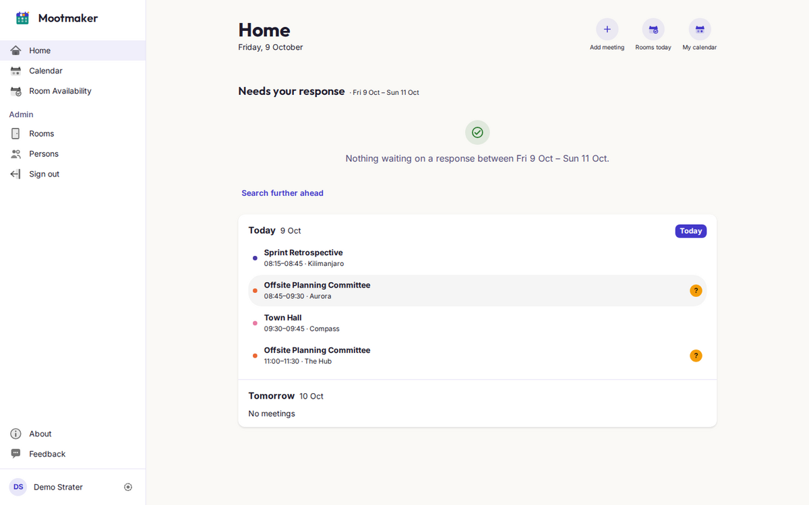

**Room Availability**: every room for one day, with when it's busy.

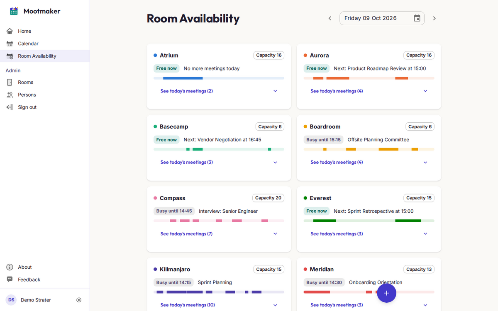

> **Notes:** Keep this to a minute. The point to land: lots of people are looking at, and changing,
> the same few days at the same time.

---

## 1. What is Mootmaker (continued)

**Calendar**: one person's week.

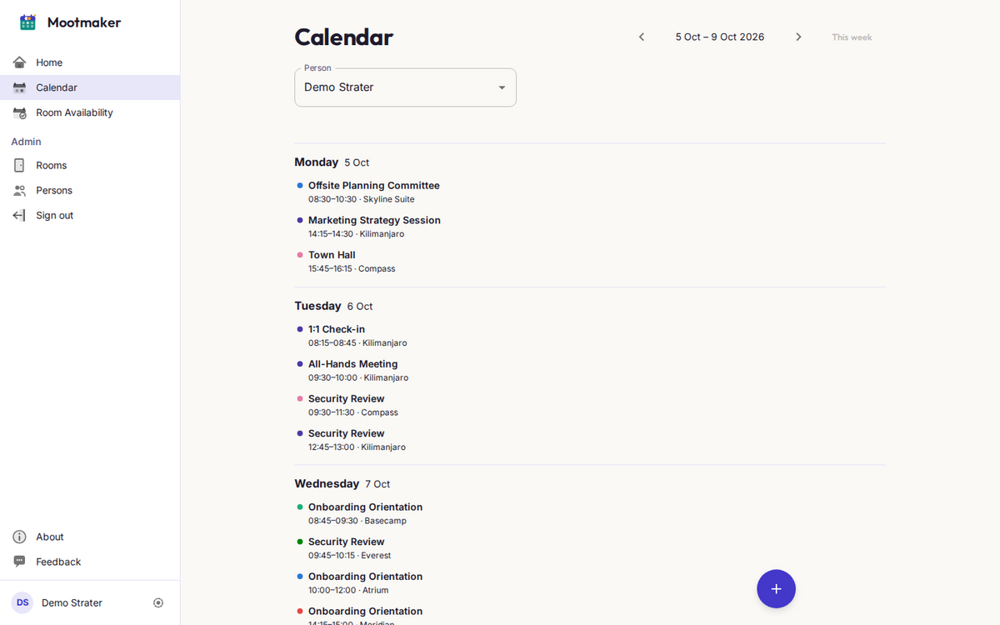

**A meeting open in the side panel**. This is the screen User A has open in the problems later on.

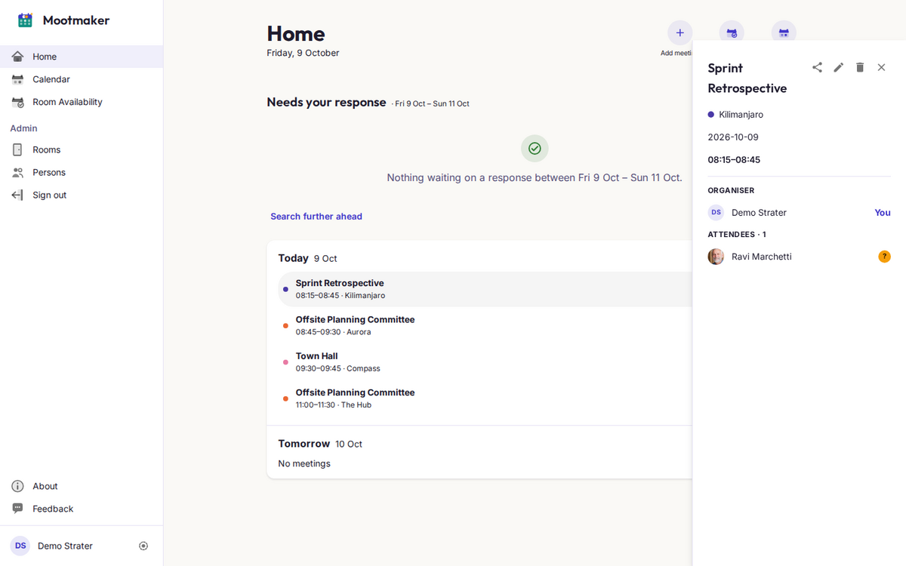

---

The question for this talk: **when one user changes a meeting, how does everyone else's screen stay
correct?**

> **Notes:** The side panel is the star of the rest of the talk: A has it open while B changes the
> meeting.

---

## 1. The domain

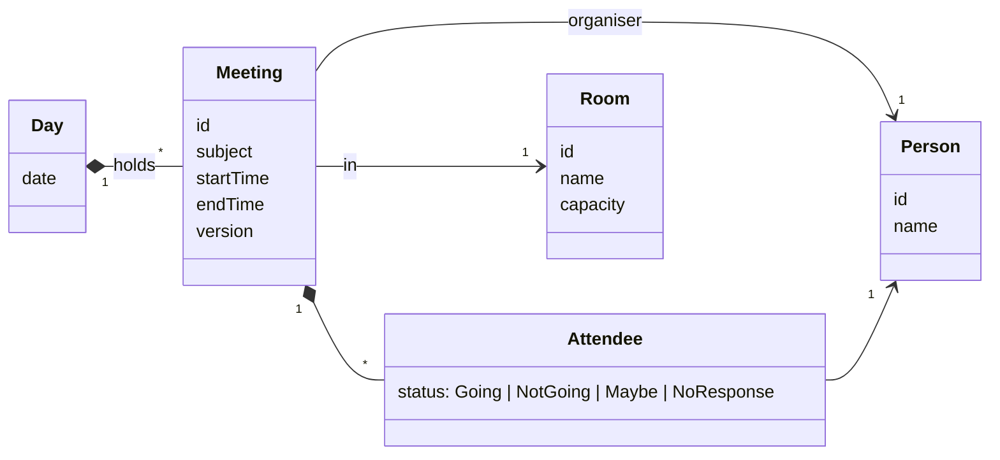

- A **Day** holds every meeting on that date, and is stored and fetched as one unit.
- A **Meeting** is in one room, has one organiser and any number of attendees, each with a response.
- **Rooms** and **people** are shared reference data, and rarely change.


> **Notes:** The Day matters later. Because a day is the unit we store and fetch, it's also the unit
> we invalidate: "8 October changed" rather than "meeting 123 changed".

---

## 2. The GraphQL API, through two users and one meeting

User A **views** a meeting. User B **changes** it. Cut down to just what they use:

```graphql
type Query {
  workspace(dates: [String!]): Workspace!   # the days on screen (home, calendar, rooms)
  meeting(id: ID!): Meeting                 # one meeting, e.g. the side panel. null = gone
}

type Workspace {
  days: [Day!]!        # one per requested date
  rooms: [Room!]!
  people: [Person!]!
}

type Day {
  date: String!
  meetings: [Meeting!]!
}

type Mutation {
  updateMeeting(id: ID!, meeting: MeetingInput!): UpdateMeetingResult!            # edit
  cancelMeeting(id: ID!): CancelMeetingResult!                                    # cancel
  respondToMeeting(meetingId: ID!, status: AttendeeStatus!): RespondToMeetingResult!  # RSVP
}

type Subscription {
  daysInvalidated: Invalidation   # everyone: "these dates changed"
}

type Invalidation {
  dates: [String!]!               # dates only, never meeting data
}
```

- Queries and mutations go over ordinary HTTP. The subscription is a WebSocket the server pushes on.
- The subscription says **that** something changed, not **what** changed. The client throws away
  what it has for those dates and asks again.

> **Notes:** Why dates and not data? A broadcast has a 240 KB cap while a busy day is ~600 KB, but
> mostly because "throw it away and ask again" can't get merging or ordering wrong.

---

## 3. The Apollo cache

The webapp keeps everything it has fetched in **Apollo's cache**, which is an **entity cache**:

```
Day:2026-10-08   { date, meetings: [→ Meeting:m-1, → Meeting:m-2] }
Meeting:m-1      { subject: "Standup", startTime, room: → Room:r-7, … }
Room:r-7         { name: "Atrium", capacity: 16 }
Person:p-42      { name: "Ada" }
```

- Each meeting, room, person and day is **stored once**, keyed by type and id. Queries hold
  references (→), not copies.
- Every screen reads the **same copy**, so change `Meeting:m-1` once and every component showing it
  re-renders: the agenda, the calendar, the open side panel.
- Removing an entry (**evicting** it) is how we say "stop trusting this".

**Where the key comes from.** Apollo adds `__typename` to every object it asks for, so each object in
a response says what type it is. The key is that type plus the object's `id`:

```
{ "__typename": "Meeting", "id": "m-1", "subject": "Standup", … }   →   Meeting:m-1
```

`Day` has no `id`, so we tell Apollo to use its `date` instead (`keyFields: ['date']`). An object with
neither isn't an entity: it's stored inside whatever contains it.

> **Notes:** Apollo does this by default for anything with an `id`. We made `Day` an entity too,
> keyed by its date, so "8 October changed" maps to exactly one cache entry. Strictly, a key built
> from `keyFields` looks like `Day:{"date":"2026-10-08"}`. These slides shorten it to
> `Day:2026-10-08`.

---

## 3. Fetch policies: render what we have, then check

Each query chooses how to balance the cache against the network:

| Policy | Reads cache first? | Goes to network? | Where we use it |
|---|---|---|---|
| `cache-first` | yes, and stops there if it has everything | only if something is missing | rooms and people. They rarely change |
| `cache-and-network` | yes, **shows it immediately** | **always**, then re-renders with the answer | every meetings query |
| `network-only` | no | always (and writes the answer to the cache) | "tell me the truth right now": the edit form, and "has this meeting really gone?" |

So the screen is always in one of three states:

| State | Meaning | On screen |
|---|---|---|
| **Unknown** | nothing cached, asking the server | full spinner |
| **Refreshing** | showing what we have, checking it's still right | last-known content **plus a slim progress bar** |
| **Settled** | the server has answered | content, no indicator |

> **Notes:** The trap is the Refreshing state: cached data might say "no meetings". Say "No meetings
> today" then, and the server may contradict you a moment later. Confident empty or negative
> messages belong only to Settled.

---

## 3. Unknown vs Refreshing, on screen

**Unknown**: a cold load of Home. Nothing is cached, so all we can show is a spinner.

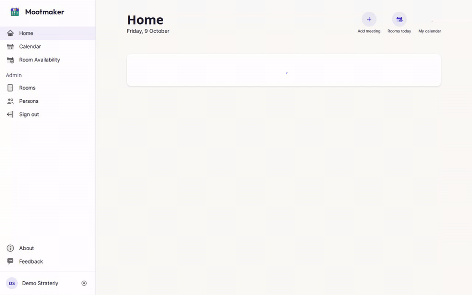

**Refreshing**: Home has been visited before. Go to Room Availability and back, and the cached agenda
is shown immediately with a progress bar along the top while the network checks it.

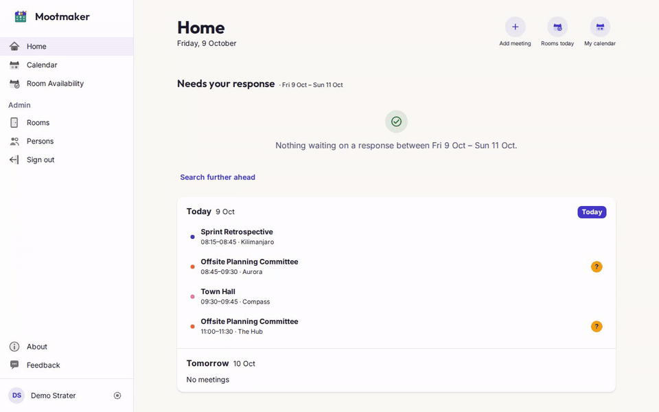

Watch Tomorrow in the second clip: "No meetings" and "Nothing waiting on a response" **disappear**
while refreshing and come back once settled. They're confident negative statements, so they wait
for the server.

> **Notes:** Both clips are the real public demo, with every GraphQL request held back 1.5 s so the
> states are visible. Without the delay they flash past in about 200 ms. MP4 versions, to pause on:
> [cold load](resources/live-updates-short/cold-load-spinner.mp4),
> [warm cache](resources/live-updates-short/warm-cache-progress-bar.mp4).

---

## 4. Problem 1: User A is viewing what User B edits

B (left) renames the meeting and saves. A (right) has it open in the side panel, and never touches
anything.

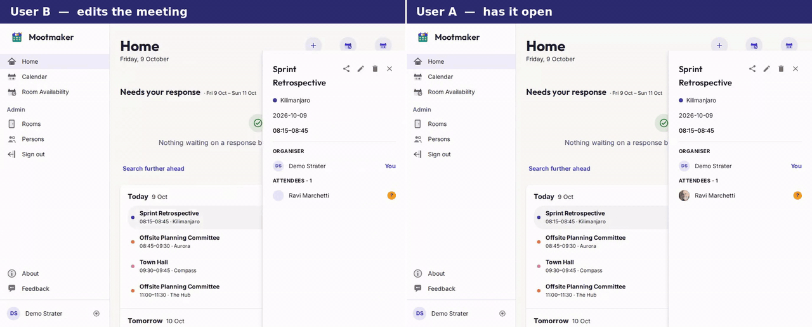

On A's side: a progress bar while the day is refetched, then the agenda row **and** the open panel
change together, because both read the same `Meeting` in the cache.

> **Notes:** Recorded on the public demo. Both windows are signed in as the shared demo account,
> the only one the demo offers, in separate browsers. That doesn't change anything here: each tab
> only ignores broadcasts for its *own* recent writes. A's requests are held back 1.2 s so the
> progress bar can be seen. The meeting was renamed back straight afterwards.
> [MP4 version](resources/live-updates-short/two-users-live-update.mp4), to pause on.

---

## 4. Problem 1, step by step

A has a meeting open in the side panel. B renames it.

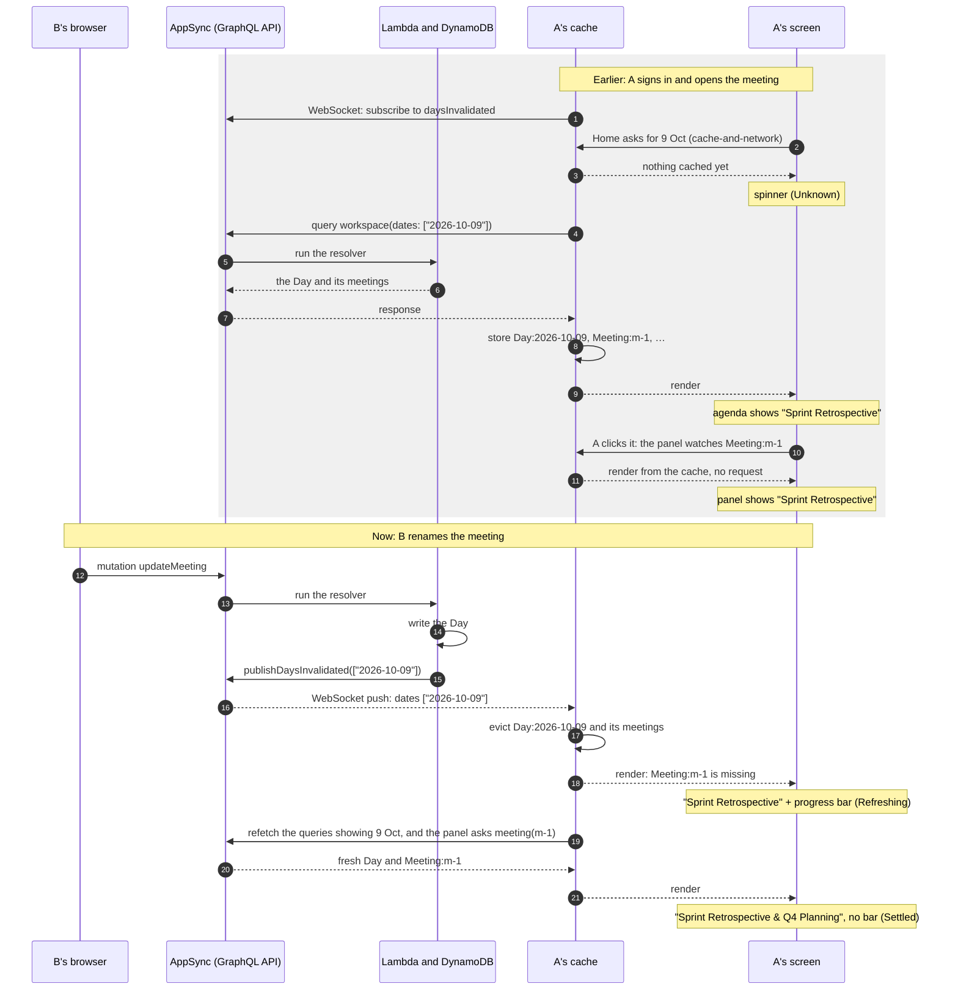

- A's React code never sees the push. It only sees the cache change, and re-renders because it's
  watching `Meeting:m-1`.
- In between, A sees the **old** meeting with a progress bar: never a blank, never "cancelled".
- Three renders: old, old + bar, new. Nothing false is ever on screen.

> **Notes:** B also receives its own broadcast. B's tab ignores dates it wrote in the last few
> seconds, otherwise the person who just saved would watch their own screen flicker.

---

## 4. What if A missed the message?

The push is **best effort**. Nothing replays a missed message, and messages get missed routinely:

- the connection drops (Wi-Fi change, laptop lid, AppSync closing an idle socket),
- the browser **freezes a background tab**, so the socket can look open while delivering nothing.

So A's tab doesn't try to work out what it missed. On **reconnect** and on **returning to the tab**,
it evicts every day it holds and refetches whatever is on screen.

> **Notes:** The design rule: correctness must not depend on the socket surviving. The socket makes
> updates fast. The resync makes them right.

---

## 5. Problem 2: User A and User B edit the same meeting

Live updates keep A's **view** current. They don't protect A's **half-finished edit**. If a save just
replaced every field, A saving a stale form would silently undo B's change.

So every meeting has a `version`, and an edit sends back the version it started from:

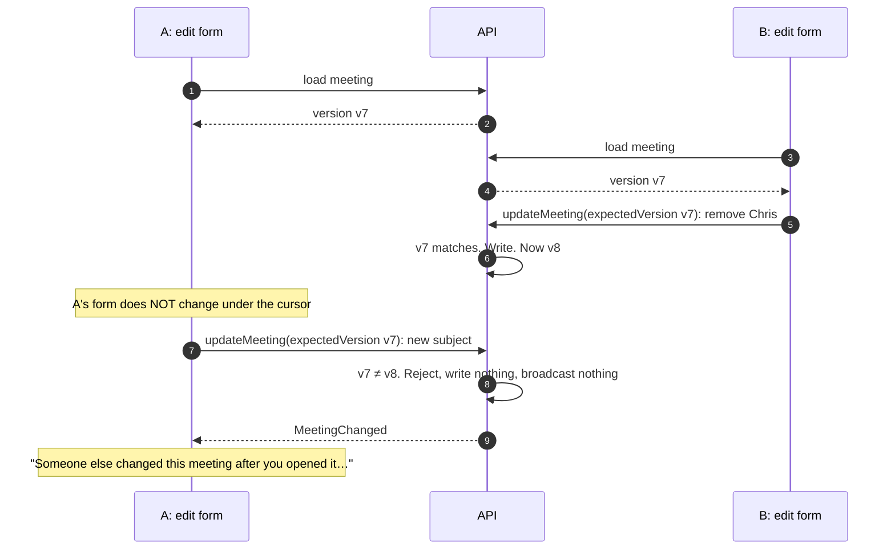

- The form **never changes under someone who is typing**. A is told instead, and redoes their change
  on the current version.
- A rejected save broadcasts nothing, so nobody's screen refreshes for a change that never happened.

> **Notes:** The real version is an opaque string derived from the meeting's fields, not a counter.
> Responding to a meeting (RSVP) deliberately doesn't change it, so accepting an invite never blocks
> the organiser's edit.

---

## 6. Complications: one subscription, carrying only dates

The "standard" GraphQL pattern is a subscription per change, carrying the changed object, which the
client merges into its cache:

```graphql
# The usual pattern: NOT what we do
type Subscription {
  meetingUpdated: UpdateMeetingResult @aws_subscribe(mutations: ["updateMeeting"])
  meetingCancelled: CancelMeetingResult @aws_subscribe(mutations: ["cancelMeeting"])
  # ...one per mutation
}
```

We have **one** subscription, fed by **one** publish-only mutation, carrying **only dates**:

```graphql
type Subscription {
  daysInvalidated: Invalidation @aws_subscribe(mutations: ["publishDaysInvalidated"])
}
```

Why:

- **Rejected writes would be broadcast.** AppSync pushes whatever the mutation returns. A rejected
  booking still returns successfully, with an errors list, so subscribers would hear about changes
  that never happened. The API calls `publishDaysInvalidated` itself, only after a write succeeds.
- **One channel covers every kind of change**: create, bulk create, edit, cancel, respond. Those
  mutations return different types, and one subscription can't follow all of them.
- **Payload size.** AppSync caps a subscription message at 240 KB. A busy day is about 600 KB, so it
  can't be pushed. A list of dates is a few bytes.
- **The client stays simple.** Dates mean "evict and refetch", nothing more. No merging, no worrying
  about messages arriving out of order or twice (evicting twice is harmless), and no special cases
  for deletes or moves.

The cost: every change costs each watching client one refetch of that day. That's cheap, and it's
the same request the screen already knows how to make.

> **Notes:** The 240 KB cap was measured, not read from the docs: a 244,440-byte publish was
> delivered, a 247,040-byte one wasn't, and the over-cap publish still returned success. Silent
> failure again.

---

## 6. Complications: who is allowed to broadcast?

The broadcast comes from a special mutation, `publishDaysInvalidated`. If any signed-in user could
call it, anyone could make every browser refetch everything, over and over.

```graphql
type Mutation {
  publishDaysInvalidated(dates: [String!]!): Invalidation @aws_iam   # server only
}
type Subscription {
  daysInvalidated: Invalidation @aws_subscribe(mutations: ["publishDaysInvalidated"])
}
```


- Users sign in with Cognito tokens. This mutation accepts **only IAM**, which only the API's own
  Lambda has, so a browser that tries is rejected before any code runs.
- Users can **listen**. Only the server can **publish**, and only after a write succeeds.


---

## 6. Complications: cancelled, or just not in my cache?

When a day is evicted, the meeting in A's open panel disappears from the cache too. The tempting
reading is "it was cancelled". **It isn't.** Missing from the cache means **"I don't know"**: an
edit, an RSVP or a tab return evicts it just the same.

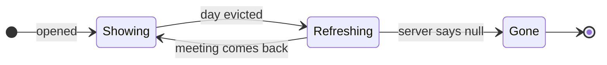

- **Refreshing**: keep showing the last-seen meeting with a progress bar, and ask the server
  `meeting(id)` with `network-only`.
- **Gone**: only when the server answers `null` does the panel say "This meeting was cancelled."

> **Notes:** The general lesson: check with the source of truth before showing anything negative.

---

## 6. Complications: a meeting moves to another day

B moves A's open meeting from 8 October to 9 October.

- The API broadcasts **both** dates, because both days changed.
- A's panel goes to Refreshing and asks `meeting(id)`. The answer, now dated the 9th, is written into
  the cache, and the panel shows it.
- No special case was needed: asking the server by id finds the meeting wherever it now lives.

> **Notes:** Same mechanism also covers the pop-out meeting page opened from a shared link, which
> holds a meeting with no day around it. Invalidating a date also evicts every cached meeting on
> that date, however it got into the cache.

---

## 7. Takeaways

1. **Broadcast *that* something changed, not *what* changed.** Invalidation is simpler and sturdier
   than replication.
2. **A publish channel is an attack surface.** Make it server-only (IAM), and scope the grant to the
   single field.
3. **Realtime failures are mostly silent. Design so that a lost message doesn't matter**: resync on
   reconnect and on tab return.
4. **"Missing from the cache" means "I don't know".** Check with the source of truth before showing
   anything negative.
5. **While refreshing, keep the last-known content up with a progress bar.** Confident empty or
   negative states belong only to the settled case.
6. **Test the journey, not only the destination.** Transient states are real states, and users see
   them.
7. **Cache behaviour is where designs are most often wrong.** Measure it, and pin it with a test that
   says why.


---

> **About the images.** Screenshots and clips were captured on 9 October 2026 from the public demo at
> www.mootmaker.com, signed in as the shared demo user, read-only, and all data shown is generated
> demo data. The clips delay GraphQL requests (1.5 s in section 3, 1.2 s for User A in
> section 4) so the loading states can be seen. The section 4 clip is the only one that changed data:
> it renamed one meeting the demo user organises, and renamed it back straight afterwards.
