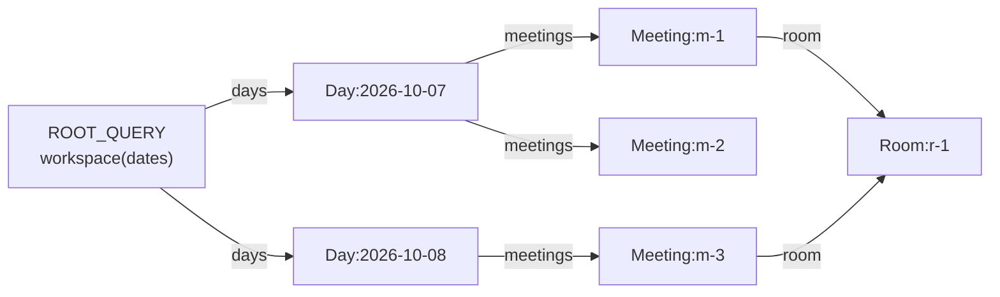
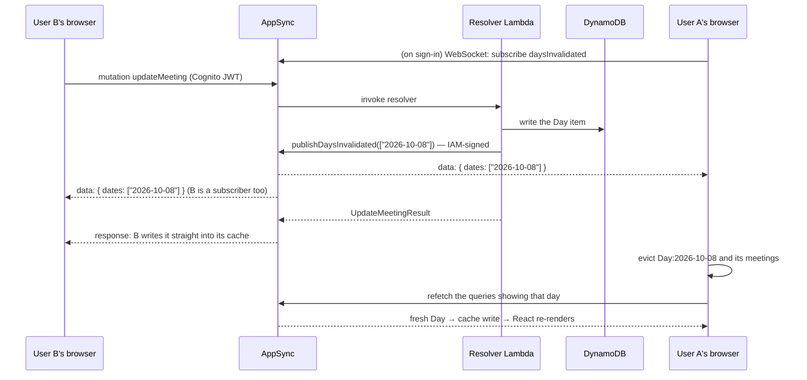
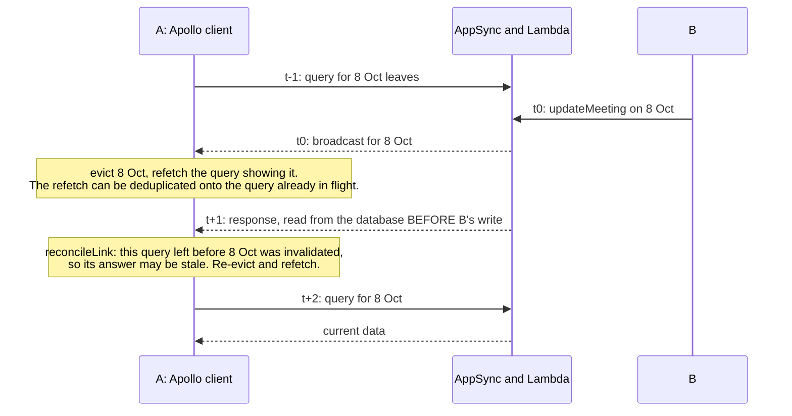
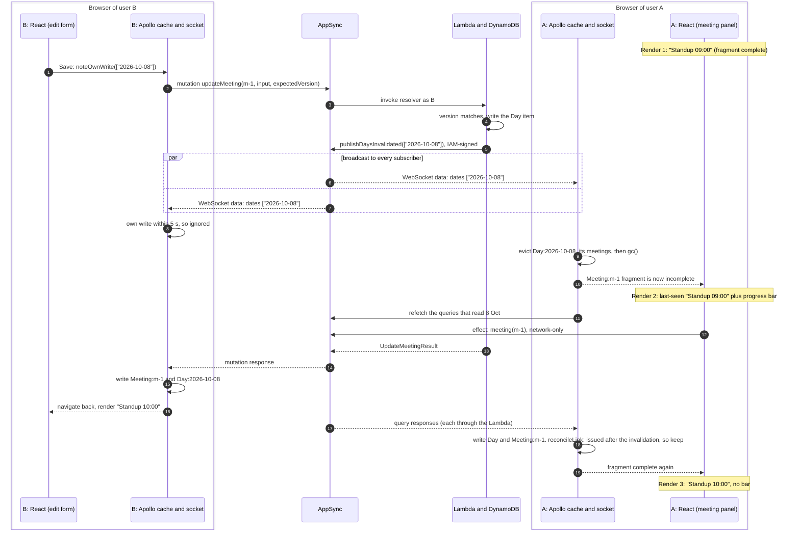
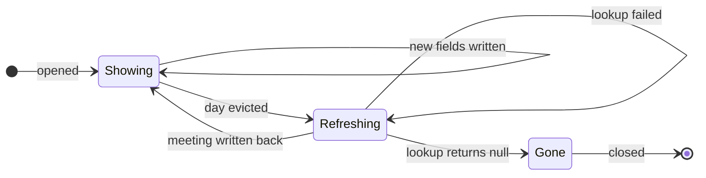
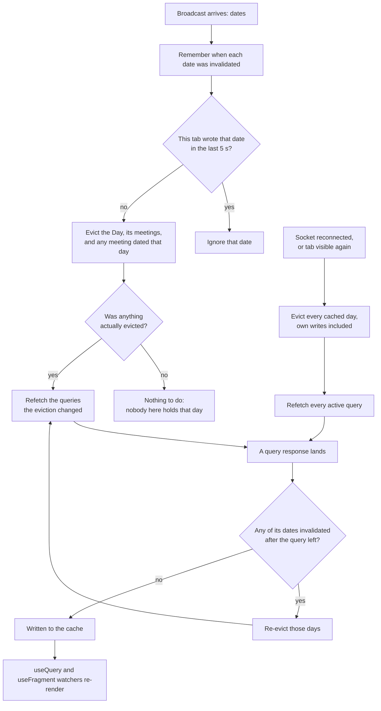
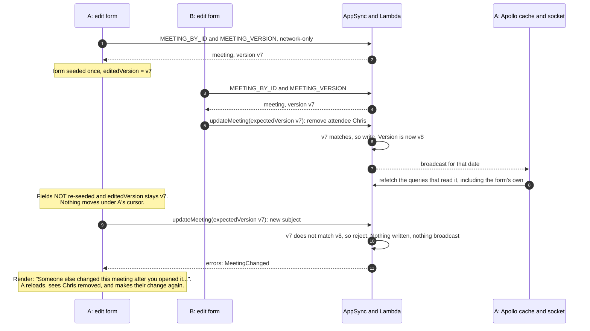

# Live updates in the webapp — a talk

How one user's change reaches another user's screen without a reload, and why the screen never
shows anything false along the way.

**Audience:** developers of mixed experience. Assumes you know roughly how a React component renders
and what an API call is. Everything else (the Apollo cache, GraphQL subscriptions, AppSync) is
introduced from scratch in Part 1.

**Length:** about 40 minutes plus questions. To bring it nearer 30, skip 4.2 and 4.3: they repeat
Parts 2 and 3 as diagrams. Each slide is separated by a horizontal rule, so the file can be presented
as-is with any Markdown slide tool (Marp, reveal-md, Slidev) or just scrolled. Speaker notes are the
quoted blocks under each slide. The diagrams are Mermaid, which GitHub renders directly; most slide
tools need a Mermaid plugin.

**Companions:** [the long write-up](live-updates-deep-dive.md), with primers and full detail, to
hand out afterwards; and [suggested answers](live-updates-open-questions.md) to the open questions
in 5.2.

| Part | What | Time |
|---|---|---|
| 0 | The scenario | 2 min |
| 1 | Primer: React renders, the Apollo cache, fetch policies, invalidation, subscriptions | 11 min |
| 2 | The server side: one broadcast, locked down, dates not data | 8 min |
| 3 | The client side: what to evict, when to refetch, what to show meanwhile | 10 min |
| 4 | Step by step: two users, one meeting, as diagrams | 7 min |
| 5 | Takeaways, open questions | 2 min |

---

## 0. The scenario

- **User A** has a meeting open in the webapp — the detail side panel, say.
- **User B**, somewhere else, changes that meeting.
- **A's screen updates by itself**, within about a second. No reload, no polling.

Questions this talk answers:

1. How does A's browser even find out?
2. How do we stop *anyone* from making every browser refresh?
3. What does A's screen show **in between** "B saved" and "A has the new data"?

Question 3 is the one that takes the most care.

> **Notes:** If you can, demo it live: two browser windows, signed in as two different users on an
> ephemeral or test environment. Open a meeting in window A, rename it in window B. Then switch
> window A to another tab and back. That triggers a refresh too, with no second user at all, and
> 3.1 explains why.

---

# Part 1 — Primer

---

## 1.1 React renders, in one slide

A component is a function from (props, state) to UI. React calls it again whenever its inputs change.

```tsx
function MeetingTitle({ id }: { id: string }) {
  const { data, loading } = useQuery(MEETING_BY_ID, { variables: { id } })
  if (loading && !data) return <Spinner />
  return <h2>{data.meeting.subject}</h2>
}
```

Four hooks are all you need for this talk:

| Hook | What it's for | Causes a re-render when it changes? |
|---|---|---|
| `useState` | values the UI depends on | **yes** |
| `useRef` | "memory" that survives renders: the last value seen, a flag | **no** |
| `useEffect` | do something *after* a render: fetch, subscribe, add listeners. It can return a cleanup function | n/a |
| `useQuery` / `useFragment` (Apollo) | read data from Apollo's cache and **watch** it | **yes**, whenever the watched cache data changes |

> **Notes:** The key mental model for the rest of the talk: *the UI is a function of the cache*.
> Change the cache, and every component watching that part of it re-renders. We almost never call
> `setState` with server data. We change the cache, and React does the rest.
>
> The `useRef` vs `useState` distinction matters in Part 3. A ref is how a component remembers
> something without causing another render.

---

## 1.2 Apollo's cache is a normalised store

Apollo doesn't store "the response to query X". It breaks responses into **entities**, each keyed by
type and id, and stores references between them.



- `Meeting:m-1` exists **once**, however many queries returned it. Update it once and every
  screen showing it updates.
- `Day` has no `id`, so we tell Apollo to key it by date: `Day: { keyFields: ['date'] }` in
  [apolloClient.ts](https://github.com/geoffweatherall/mootmaker-webapp/blob/main/webapp/src/apolloClient.ts).
  The client can then **construct a day's cache key itself** from just a date. That fact carries
  the whole live-update design.
- Home, Person Calendar and Room Availability all read the *same* `Day` entities.

> **Notes:** Apollo actually writes the key as `Day:{"date":"2026-10-08"}`. This talk shortens it.
> The code never builds the string by hand; it asks `cache.identify(...)`. The day-keyed schema was
> its own design ([graphql-schema-and-caching](../../designs/archive/graphql-schema-and-caching.md)).
> The thing to take from it here is that a day is the unit of storage, the unit of caching, *and*
> the unit of invalidation. They're all the same thing, on purpose.

---

## 1.3 Reading from the cache: "complete" or not

When a component asks for data, Apollo first tries to answer **from the cache alone**.

- Every requested field present → the read is **complete**.
- Anything missing → **incomplete**, and (depending on fetch policy) Apollo goes to the network.

Two ways we read:

```tsx
// A whole query. Returns data + loading + previousData.
const { data, loading, previousData } = useQuery(PAGE_LOAD, { variables: { dates } })

// ONE entity, live, whichever query put it in the cache. Returns data + complete.
const { data, complete } = useFragment({
  fragment: MEETING_LIVE_FIELDS_FRAGMENT,
  from: { __typename: 'Meeting', id: meetingId },
})
```

The open meeting panel uses `useFragment`, so it updates whenever `Meeting:<id>` changes in the
cache, however that happens.

> **Notes:** Remember `complete`. In 3.4, the question "my fragment just went incomplete — what
> does that mean?" turns out to be the most important one in the client.

---

## 1.4 Fetch policies: render what we have, then check

The fetch policy decides the cache vs network trade-off for each query.

| Policy | Reads cache first? | Goes to network? | Where we use it |
|---|---|---|---|
| `cache-first` (default) | yes, and stops there if complete | only if the cache is incomplete | rooms and people (`REFERENCE_DATA`). They rarely change |
| `cache-and-network` | yes, **renders it immediately** | **always**, then re-renders with the answer | every meetings query: `PAGE_LOAD`, `DAYS`, `MEETING_BY_ID` |
| `network-only` | no | always (and still writes the result to the cache) | "tell me the truth right now": the edit form, and the detail panel's "is it really gone?" check |

What `cache-and-network` looks like over time:

| Render | `data` | `loading` | What the user sees |
|---|---|---|---|
| 1 (instant) | from the cache, possibly stale | `true` | last-known meetings **plus a slim progress bar** |
| 2 (~200 ms later) | from the network | `false` | current meetings, no bar |

That's the webapp-wide rule: **show the last-known content straight away, put a progress bar over
it, and replace it when the network answers.** See the
[Progress indicators](https://github.com/geoffweatherall/mootmaker-webapp/blob/main/README.md#progress-indicators)
section of the webapp README.

> **Notes:** Render 1 has a trap. Cached data might say "zero meetings". Render "No meetings
> today" in render 1 and you've said something confident that render 2 might contradict. So there
> are three states, not two:
>
> ```tsx
> const unknown    = loading && data === undefined  // nothing at all yet: spinner
> const refreshing = loading && data !== undefined  // show what we have + bar, no confident "empty" copy
> const settled    = !loading                       // now "No meetings" is allowed
> ```

---

## 1.5 What "invalidation" means

Cached data is a **copy**. When the original changes, the copy is wrong, and nothing in the cache
knows.

**Invalidation** is telling the cache "stop trusting this". Apollo gives us three tools:

| Tool | What it does |
|---|---|
| `cache.evict({ id: 'Day:2026-10-08' })` | removes that entity. Anything referencing it now has a **dangling reference** |
| `cache.gc()` | garbage-collects entities nothing references any more |
| `client.refetchQueries({ include: 'active' })` | re-runs every query a mounted component is currently watching, over the network |
| `client.refetchQueries({ updateCache, onQueryUpdated })` | runs a cache change, then calls back for **just the watched queries it affected**, so you can refetch only those |

The trade-off to keep in mind:

- **Evict a day nobody is looking at** → costs nothing. It's fetched fresh if someone navigates
  there later.
- **Evict a day somebody *is* looking at** → there is a **gap**: a moment when the cache doesn't
  have it and the network hasn't answered yet. What the screen shows in that gap is the subject of
  Part 3.

> **Notes:** "There are only two hard things in computer science: cache invalidation and naming
> things." This talk is about the first one. You'll notice we only invalidate. We never try to patch
> the cache with what changed.

---

## 1.6 GraphQL subscriptions, and how AppSync does them

GraphQL has three kinds of operation:

| | Who starts it | Transport |
|---|---|---|
| `query` | client asks, server answers | HTTP POST |
| `mutation` | client asks to change something, server answers | HTTP POST |
| `subscription` | client asks once, **server pushes** whenever something happens | WebSocket |

**AppSync's twist:** a subscription field has no code behind it. It says *"when mutation X
succeeds, push a copy of X's return value to everyone subscribed"*:

```graphql
type Subscription {
  daysInvalidated: Invalidation @aws_subscribe(mutations: ["publishDaysInvalidated"])
}
```

The WebSocket conversation, written by hand in
[appsyncSocket.ts](https://github.com/geoffweatherall/mootmaker-webapp/blob/main/webapp/src/realtime/appsyncSocket.ts):

```
open wss://…/graphql/realtime?header=<base64 JWT>&payload=e30=
→ connection_init          ← connection_ack {connectionTimeoutMs: 300000}
→ start {subscription…}    ← start_ack        (only NOW is it live)
                           ← ka               (keep-alive, about every 60 s)
                           ← data {daysInvalidated: {dates: [...]}}
```

Three facts, measured against a real AppSync API before any code was written, shape everything
after this:

1. **No replay.** A message published while you're disconnected is gone for good.
2. **Connections drop routinely.** Idle timeout, laptop lid, phone backgrounding the tab.
3. **Most failures are silent.** The publisher sees success and the subscriber gets nothing.

> **Notes:** Why hand-written? AppSync refuses `graphql-transport-ws`, the protocol Apollo's
> `GraphQLWsLink` and every common library speak. The socket just closes with 1006. AppSync's own
> protocol is *also* called `graphql-ws` but is a different message format. It's about 100 lines,
> and it isn't an Apollo link either, because no component ever renders the subscription. Its only
> job is to evict things from the cache.
>
> Why AppSync at all, rather than server-sent events from a Lambda? Cost. A Lambda holding an idle
> connection is billed wall-clock: about US$70/month for ten users on an eight-hour day, against
> fractions of a cent for AppSync connection-minutes.

---

# Part 2 — The server side

---

## 2.1 The whole flow



Four design choices to unpack:

1. **One special publish mutation**, not subscriptions on the real mutations.
2. **Only the server can call it** (IAM), not users.
3. **The broadcast carries dates, not data.**
4. **The client assumes broadcasts get lost.**

> **Notes:** This is the overview; 4.1 has the same flow in full, with every render on A's screen.
> Point out that B also receives its own broadcast, which 3.1 deals with. And note that the publish
> happens *inside* B's request, after the database write has committed but before B gets a
> response. So A, and B's own tab, can hear about the change before B sees the result of saving it.

---

## 2.2 Why one special `publishDaysInvalidated` mutation?

The obvious design is `@aws_subscribe(mutations: ["createMeeting", "updateMeeting", ...])`. Each
problem with it was **verified on a throwaway AppSync API**, not taken from the docs:

| Problem | Detail |
|---|---|
| **Rejected writes get broadcast** | A `createMeeting` rejected with `errors: ["RoomUnavailable"]` still *returns successfully* (validation errors are data). AppSync broadcast it exactly like a real booking |
| **One subscription can't span return types** | `createMeeting` returns `CreateMeetingResult`, `createMeetings` returns `CreateMeetingsResult`, and so on. A subscription's type must equal the mutation's |
| **Too big** | Subscription payloads are capped at 240 KB. A worst-case `Day` is about 618 KB |
| **Filters lie** | Subscription filters that use an unsupported operator *silently* match everything or nothing. We saw both directions, and neither raised an error |

So instead there's a dedicated field, called **only after a write has committed**:

```graphql
"NOT FOR CLIENT USE ... purely to drive Subscription.daysInvalidated."
publishDaysInvalidated(dates: [String!]!): Invalidation @aws_iam
```

Its resolver is a **NONE data source**. It runs no code and just echoes its arguments back, which
gives AppSync something to broadcast.

> **Notes:** Every meeting-writing handler in the API finishes with one line, for example
> `broadcaster.publish(List.of(currentDate, requestedDate))` when a meeting moves day. Bulk creation
> of 99 meetings on one date publishes *once*. A rejected write publishes nothing. Code:
> [DaysInvalidatedPublisher.java](https://github.com/geoffweatherall/mootmaker-api/blob/main/impl/src/main/java/com/mootmaker/realtime/DaysInvalidatedPublisher.java).

---

## 2.3 Stopping strangers from refreshing every screen

The threat: if *anyone* can call the publish mutation, they can make **every connected browser
evict and refetch**, as often as they like. One call becomes N refetches, and AppSync bills per
delivery per subscriber.

Signing in is not enough of a barrier here. **Anyone can sign up**, and with our API's default auth
mode **every valid user token can reach every field** (admin checks live in the Lambda, not the
gateway). Layered defences:

| Layer | Where | Effect |
|---|---|---|
| 1. Cognito JWT required for everything, including opening the WebSocket | `authentication_type = "AMAZON_COGNITO_USER_POOLS"` | anonymous visitors can't listen or call anything |
| 2. **`@aws_iam` on `publishDaysInvalidated`** | schema | AppSync rejects a user token **before any resolver runs**. Only an AWS-signed (SigV4) request gets through |
| 3. **The Lambda's IAM grant names exactly one field** | [iam.tf](https://github.com/geoffweatherall/mootmaker-api/blob/main/deploy/terraform/iam.tf): `…/types/Mutation/fields/publishDaysInvalidated` | the server's own credentials can do this one thing and nothing else on the API |
| 4. The payload is just dates | schema | a subscriber learns "something changed on 8 Oct", never what or by whom |

```hcl
authentication_type = "AMAZON_COGNITO_USER_POOLS"      # users
additional_authentication_provider {
  authentication_type = "AWS_IAM"                       # our own Lambda, and only for the one field
}
```

> **Notes:** Two independent locks, 2 and 3, and the design deliberately trusts neither on its own.
>
> Two traps worth knowing about, both silent:
> - The `Invalidation` type must carry **both** `@aws_iam @aws_cognito_user_pools`, because it's
>   written by one principal and read by another. Leave one off and subscribing still succeeds, you
>   get `start_ack`, and then nothing ever arrives. The only error is in the *publisher's* 200
>   response, inside a Lambda nobody is watching. So the publisher reads the response body for
>   `"errors"` rather than trusting HTTP 200.
> - `default_action = "ALLOW"` looks like it could be tightened to `DENY`. It can't: AppSync rejects
>   `DENY` once an additional provider exists.

---

## 2.4 Why dates, not data?

The broadcast is literally `{ "dates": ["2026-10-08"] }`.

- **Always tiny.** The largest possible broadcast, every day in the window, is about 2.9 KB, around
  1% of the cap.
- **One channel for every kind of change**: create, bulk create, edit, cancel, RSVP.
- **Idempotent.** Getting "8 Oct changed" twice is harmless. Getting "add meeting m-9" twice needs
  de-duplication.
- **Nothing to merge, no ordering to reason about.** The client doesn't apply changes. It throws
  away what it has and asks again.

And on failure, **the write wins**:

```java
// DaysInvalidatedPublisher.publish — never throws
} catch (RuntimeException | IOException e) {
  LOG.warn("Failed to broadcast day invalidation for {} - clients will refetch on their own", dates, e);
}
```

A broadcast is an optimisation. Failing a booking that has already committed just because a
notification failed would turn a missed refresh into a lost booking. Publishing also has a 2-second
timeout, because B is waiting on it.

> **Notes:** This is the "invalidation, not replication" idea. We aren't keeping A's cache in sync
> with B's change. We're telling A that its copy of 8 October is suspect.

---

# Part 3 — The client side

---

## 3.1 Four rules for the socket

In
[useDaysInvalidated.ts](https://github.com/geoffweatherall/mootmaker-webapp/blob/main/webapp/src/realtime/useDaysInvalidated.ts)
and
[daysInvalidated.ts](https://github.com/geoffweatherall/mootmaker-webapp/blob/main/webapp/src/realtime/daysInvalidated.ts).

**1. Subscribe once, above the router.** `useDaysInvalidated(signedIn)` is called in `App.tsx`, not
per page. A per-page subscription would reconnect on every navigation and stop maintaining days
cached for other screens.

**2. On a broadcast: evict, then refetch exactly what that changed.**

```ts
onData: ({ dates }) => {
  // the Day, its meetings, and meetings dated that day - then refetch the queries that read them
  evictAndRefetch(apolloClient, () => dayInvalidations.invalidate(dates))
}

function evictAndRefetch(client, evict) {
  client.refetchQueries({
    updateCache: () => evict(),                     // Apollo notes which watched queries this changes…
    onQueryUpdated: (query) => query.refetch(),     // …and calls back for exactly those
  })
}
```

A day nobody here holds, or this tab's own write, changes nothing, so it refetches nothing.

**3. Ignore broadcasts for my own writes, and say so before sending.** B's tab gets its own
broadcast. Acting on it would throw away the authoritative state its own mutation response is about
to write, for nothing. So a tab notes the dates it's about to write (`noteOwnWrite`) **before
sending the request**, and ignores invalidations for them for 5 seconds. *Before*, because the
server broadcasts before it responds, so the broadcast can arrive first.

**4. Never trust the socket.** On reconnect *and* whenever the tab becomes visible again:

```ts
dayInvalidations.invalidateEverything()              // every held day, own writes included
apolloClient.refetchQueries({ include: 'active' })   // everything on screen, deliberately
```

There's no replay, so we can't know what was missed. We only know to stop trusting what we hold.
**Correctness doesn't depend on the WebSocket staying up.**

> **Notes:** Rule 3 has a stated cost. If someone *else* changes the same date within those 5
> seconds, this tab misses it until the next broadcast or tab return. See 5.2.
>
> Rule 4 is why the "switch tabs" part of the demo triggers a refresh.

---

## 3.2 Two Apollo subtleties: eviction doesn't refetch, and a refetch overwrites

You might expect *"evict `Day:<date>` and Apollo notices the gap and fetches it"*. It doesn't:

```ts
cache.evict({ id: 'Day:2026-09-14' })
cache.diff(WORKSPACE_QUERY)
// → complete: true, result: { workspace: { days: [] } }    ← not "incomplete"!
```

`workspace.days` still holds a reference to the evicted day. **Apollo quietly filters dangling
references out of lists**, so the query reads back as *complete, with one fewer day*. No gap means
no fetch.

Hence the explicit refetch in rule 2. A unit test pins this Apollo behaviour, and says so: if a
future Apollo version makes that read incomplete, the test fails and the refetch can be deleted.

**A second subtlety: a refetch overwrites by default.** Every `workspace` query (days, rooms and
people, the bookable window) shares one stored `workspace` object. Apollo writes a *refetch* in
overwrite mode unless told otherwise, so refetching the days would replace that object with just
`{ days }`, wiping the rooms and people that other queries on the page are showing. They'd all go
back to the network. One client option fixes it:

```ts
new ApolloClient({ cache, link, defaultOptions: { watchQuery: { refetchWritePolicy: 'merge' } } })
```

> **Notes:** The general lesson: cache behaviour is the part of a design you can't check by
> reading. Measure it, and pin it with a test that says why. Remember "complete, minus that day".
> It comes back in 3.6.

---

## 3.3 The in-flight race

A query can already be **on its way** when a broadcast arrives:



Without the last step, A would hold pre-change data with **nothing left to trigger a refetch**.

[reconcileLink.ts](https://github.com/geoffweatherall/mootmaker-webapp/blob/main/webapp/src/realtime/reconcileLink.ts)
is an Apollo link. For every query it records when the request left. Once Apollo has written the
response, it asks: was any date in this response invalidated *after* the request left? If so, it
re-evicts those days and refetches.

> **Notes:** Mutations are skipped: a mutation's response is this tab's own write, the most
> authoritative data there is. The test drives a real `ApolloClient`, because "after Apollo has
> written the response" is exactly the kind of cache timing you can't safely assume.

---

## 3.4 The meeting panel: missing is not cancelled

When A's day is evicted, the meeting's entity goes with it, and the panel's fragment goes
**incomplete**. The tempting reading is "it was deleted":

```tsx
// Tempting, and wrong
const cancelledElsewhere = wasEverComplete && !complete
if (cancelledElsewhere) return <EmptyState message="This meeting was cancelled." />
```

But the fragment goes incomplete on **every** eviction: an edit to any meeting that day, an RSVP, a
tab return, or the meeting moving to a day nobody is watching. **"Missing from my cache" means "I
don't know", not "it doesn't exist".** So the panel asks the source of truth:

```tsx
const { data: live, complete } = useFragment({ fragment: MEETING_FIELDS, from: meetingRef })

const wasEverComplete = useRef(false)
if (complete) wasEverComplete.current = true
const missing = wasEverComplete.current && !complete       // a fact about the CACHE, not the world

const lastSeen = useRef<Meeting | null>(null)              // a ref: remembering mustn't re-render
if (complete) lastSeen.current = live

const [confirmedGone, setConfirmedGone] = useState(false)  // state: this SHOULD re-render
useEffect(() => {
  if (!missing) { setConfirmedGone(false); return }
  let active = true
  client.query({ query: MEETING_BY_ID, variables: { id }, fetchPolicy: 'network-only' })
    .then(({ data }) => { if (active && !data?.meeting) setConfirmedGone(true) })
  return () => { active = false }                          // ignore answers that arrive too late
}, [missing, id])

if (missing && confirmedGone) return <EmptyState message="This meeting was cancelled." />
return (
  <>
    {missing && <LinearProgress aria-label="Refreshing meeting" />}
    <MeetingView meeting={lastSeen.current ?? openedWith} />
  </>
)
```

> **Notes:** Simplified from
> [MeetingDetailContent.tsx](https://github.com/geoffweatherall/mootmaker-webapp/blob/main/webapp/src/components/MeetingDetailContent.tsx).
> Points to draw out:
> - **`useRef` vs `useState` in practice.** `lastSeen` and `wasEverComplete` are memory, and
>   updating them must not cause another render. `confirmedGone` is a decision the screen depends
>   on, so it's state.
> - **The `active` flag** is the standard "stale response" guard. If the meeting comes back (so
>   `missing` goes false) before the lookup answers, the cleanup runs and the late answer is
>   ignored.
> - **`network-only` still writes to the cache.** If the meeting exists, writing it makes the
>   fragment complete again, so the panel updates by itself, **including when the meeting has moved
>   to another day**. No special case needed.
> - For the more experienced: writing a ref during render is something React's docs discourage in
>   general, because a render can be thrown away. It's tolerable here because the value written is
>   always real cache data, but it's a fair thing to question.

---

## 3.5 Meetings held without their day

The pop-out page `/meetings/:id` is usually opened cold, from a shared link. It holds the `Meeting`
through `meeting(id)`, but **no `Day`**. Evicting `Day:<date>` alone wouldn't touch it.

So invalidating a date also evicts **every cached meeting dated on it**, wherever it came from:

```ts
for (const [id, entity] of Object.entries(cache.extract()))
  if (entity.__typename === 'Meeting' && entity.startTime?.startsWith(date)) cache.evict({ id })
```

The pop-out page then goes down exactly the same "missing → ask → refresh or confirm gone" path as
the panel. Both render the same `MeetingDetailContent` component, so they **behave** the same, not
just look the same.

> **Notes:** The general rule: invalidation has to reach the data however it got into the cache,
> not just via the path the common screens use.

---

## 3.6 Multi-day lists keep a day while it reloads

Remember 3.2: after an eviction, a **multi-day** query reads back *complete, minus that day*. Left
alone, Home's agenda and Person Calendar would drop that day's meetings until the refetch lands.

So while a query is loading, any requested day missing from `data` is kept from `previousData`:

```tsx
const { data, previousData, loading } = useQuery(PAGE_LOAD, {
  variables: { dates }, fetchPolicy: 'cache-and-network',
})
const shown = keepDaysWhileRefreshing(data, previousData, loading, dates)

function keepDaysWhileRefreshing(data, previousData, loading, requested) {
  if (!loading || !data || !previousData) return data            // settled: trust the server
  const present = new Set(data.workspace.days.map((d) => d.date))
  const kept = previousData.workspace.days
    .filter((d) => requested.includes(d.date) && !present.has(d.date))
  return { ...data, workspace: { ...data.workspace, days: [...data.workspace.days, ...kept] } }
}
```

Room Availability, which reads **one** day, doesn't need this. When the only requested day is
missing, our `read` policy reports `days` as *missing* rather than *empty*, so the read is
incomplete rather than "complete and empty".

> **Notes:** `previousData` is Apollo's: the last result this `useQuery` returned before the
> current one. This is the same rule as 1.4 and 3.4, applied per day: keep the last-known content up
> with a bar over it, and only believe an absence once loading has settled. Code:
> [keepDaysWhileRefreshing.ts](https://github.com/geoffweatherall/mootmaker-webapp/blob/main/webapp/src/graphql/keepDaysWhileRefreshing.ts).

---

## 3.7 Testing the journey, not just the destination

A test that waits for "the new title appears within 30 s" **polls until it's true**. It can't see
something false that was on screen for one second along the way.

So `live-updates.spec.ts` does this, against a real deployment:

1. Sign in user A and open the view under test, with a
   [recorder](https://github.com/geoffweatherall/mootmaker-webapp/blob/main/acceptance/tests/support/liveRecorder.ts)
   injected before any app code runs.
2. Trigger a refresh: user B changes something over the API (or in a second browser, where B's own
   screen matters), or A simply switches tabs away and back.
3. Assert three things:
   - **no painted transient** of any negative phrase ("cancelled", "No meetings", "Free all day", …)
   - **the watched content never disappears** on the way
   - **the end state is right**

The recorder samples the visible text on every `requestAnimationFrame`, so if a state was seen, it
was on screen to within a frame. It also logs every AppSync message, so you can line up "broadcast
arrived" against "screen changed".

> **Notes:** Unit tests cover the pieces with fake clocks: which days are evicted, the own-write
> guard, the race. Some of them drive a real `ApolloClient`, because Apollo's own behaviour is part
> of what's under test. But only a real deployment has a real AppSync broadcast.

---

# Part 4 — Step by step: two users, one meeting

---

## 4.1 B edits a meeting while A is looking at it

The full flow. A has meeting `m-1` ("Standup", 8 October) open in the side panel. B is in the edit
form and changes the start time.



A's panel renders three times: the old meeting, the old meeting with a progress bar, and the new
meeting. It never shows anything that's false.

> **Notes:** Walk it left to right, top to bottom. Things to point at:
> - Step 1 happens **before** step 2: rule 3 from 3.1.
> - Steps 6 and 7 happen in parallel, and both happen **before** B gets a response (step 14).
> - A's React code never sees the broadcast. It only sees the cache change (step 10), and re-renders
>   because `useFragment` is watching `Meeting:m-1`.
> - Render 2 is 3.4 in action: last-seen content and a bar, never "cancelled".
> - Steps 11 and 12 are two independent requests. Whichever lands first makes the fragment complete
>   again, and the other one is a harmless rewrite.

---

## 4.2 The meeting panel's states

What `MeetingDetailContent` can be showing, and what moves it between them:



| State | On screen | Gets here when |
|---|---|---|
| **Showing** | the meeting, from its live fragment | opened from a row (shows the row's snapshot until the fragment resolves), or an edit or RSVP is written to the cache |
| **Refreshing** | the last-seen meeting **plus a progress bar** | its day is evicted (a broadcast, a tab return, a reconnect), so it asks `meeting(id)` with `network-only`. A failed lookup stays here and asks again next time |
| **Gone** | "This meeting was cancelled." | the lookup returned `null`: cancelled, or aged out of retention |

From Refreshing, "meeting written back" can come from the day's refetch or from the lookup, and it
may carry a new date if the meeting moved.

> **Notes:** Mapping to the code: `missing` is "in Refreshing or Gone", `confirmedGone` separates
> the two, and `lastSeen` is what Refreshing displays. The tempting version in 3.4 has no
> Refreshing state at all: it goes straight from Showing to Gone.

---

## 4.3 What one tab does with each trigger

Part 3 in one picture: three triggers, one cache, and React re-rendering at the end.



> **Notes:** The left branch is the normal case. The middle one exists because the socket can't be
> trusted (no replay, idle timeouts, frozen background tabs). The bottom loop is the race from 3.3.
> It terminates because each refetch leaves after the invalidation that caused it. The
> "Nothing to do" box is deliberate: a broadcast for a day this tab has never fetched costs nothing.

---

## 4.4 A and B both editing the same meeting

Live updates keep A's *view* current. They don't, on their own, protect A's *edits*: if
`updateMeeting` just replaced every field, saving a stale form would silently undo someone else's
change. So edits carry the version they were made against:



> **Notes:** `v7` and `v8` are illustrative. The real version is an opaque string the API derives
> from the meeting's fields. Points to draw out:
> - **Two deliberate choices meet here.** The form never changes under someone who is typing
>   (changing a form mid-edit is disorienting and loses input), so it holds the version it was
>   seeded with, not whatever a refetch brings back.
> - **The API checks twice**: once up front, and again inside the read-modify-write of the day, so
>   a change landing between the two is still caught.
> - A rejected save publishes nothing, so nobody else's screen refreshes for a change that never
>   happened. That's the same reason as 2.2.

---

# Part 5 — Wrapping up

---

## 5.1 Takeaways

1. **Broadcast *that* something changed, not *what* changed.** Invalidation is simpler and sturdier
   than replication.
2. **A publish channel is an attack surface.** Make it server-only (IAM), and scope the grant to the
   single field.
3. **Realtime failures are mostly silent. Design so that a lost message doesn't matter**: resync on
   reconnect and on tab return.
4. **"Missing from the cache" means "I don't know".** Check with the source of truth before showing
   anything negative.
5. **While refreshing, keep the last-known content up with a progress bar.** Confident empty or
   negative states belong only to the settled case.
6. **Test the journey, not only the destination.** Transient states are real states, and users see
   them.
7. **Cache behaviour is where designs are most often wrong.** Measure it, and pin it with a test that
   says why.

---

## 5.2 Open questions, for discussion

1. **The own-write window.** For 5 s after saving, a tab ignores broadcasts for those dates,
   including a genuine change by someone else. Is 5 s right?
2. **Every signed-in client receives every broadcast.** Is that OK, on privacy and on cost?
3. **Rooms and people aren't broadcast.** An admin's new room doesn't appear on other screens until
   they refresh. Should it?

> **Notes:** Suggested answers, with the reasoning and numbers, are in
> [live-updates-open-questions.md](live-updates-open-questions.md). Try to get the room's view
> before showing them.

---

## 5.3 Where to read more

| What | Where |
|---|---|
| The long write-up, with primers | [live-updates-deep-dive.md](live-updates-deep-dive.md) |
| The design, including "Verified: AppSync subscription behaviour" | [graphql-schema-and-caching.md](../../designs/archive/graphql-schema-and-caching.md) |
| Why meetings are evicted along with their day | [edit-and-cancel-meetings.md](../../designs/archive/edit-and-cancel-meetings.md), Decision 10 |
| Client: socket, evictions, hook, race guard | [appsyncSocket.ts](https://github.com/geoffweatherall/mootmaker-webapp/blob/main/webapp/src/realtime/appsyncSocket.ts), [daysInvalidated.ts](https://github.com/geoffweatherall/mootmaker-webapp/blob/main/webapp/src/realtime/daysInvalidated.ts), [useDaysInvalidated.ts](https://github.com/geoffweatherall/mootmaker-webapp/blob/main/webapp/src/realtime/useDaysInvalidated.ts), [reconcileLink.ts](https://github.com/geoffweatherall/mootmaker-webapp/blob/main/webapp/src/realtime/reconcileLink.ts) |
| Cache policies | [apolloClient.ts](https://github.com/geoffweatherall/mootmaker-webapp/blob/main/webapp/src/apolloClient.ts) |
| The meeting panel | [MeetingDetailContent.tsx](https://github.com/geoffweatherall/mootmaker-webapp/blob/main/webapp/src/components/MeetingDetailContent.tsx) |
| Server: schema, publisher, auth | [mootmaker.graphql](https://github.com/geoffweatherall/mootmaker-api/blob/main/api/mootmaker.graphql), [DaysInvalidatedPublisher.java](https://github.com/geoffweatherall/mootmaker-api/blob/main/impl/src/main/java/com/mootmaker/realtime/DaysInvalidatedPublisher.java), [appsync.tf](https://github.com/geoffweatherall/mootmaker-api/blob/main/deploy/terraform/appsync.tf), [iam.tf](https://github.com/geoffweatherall/mootmaker-api/blob/main/deploy/terraform/iam.tf) |
| The acceptance tests | [live-updates.spec.ts](https://github.com/geoffweatherall/mootmaker-webapp/blob/main/acceptance/tests/live-updates.spec.ts) |

**Questions?**
