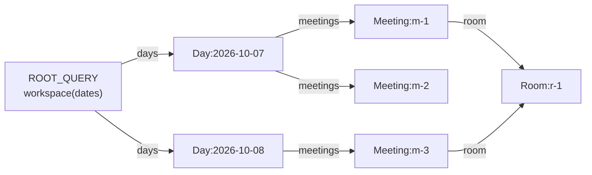
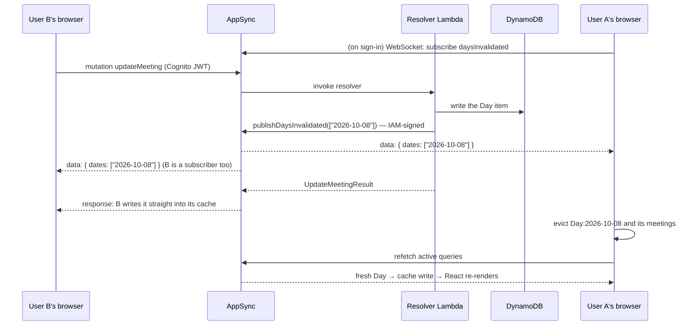

# Live updates in the webapp — a talk

How one user's change reaches another user's screen without a reload, and what it took to make
that look right rather than just end up right.

**Audience:** developers of mixed experience. Assumes you know roughly how a React component renders
and what an API call is. Everything else (the Apollo cache, GraphQL subscriptions, AppSync) is
introduced from scratch in Part 1.

**Length:** about 35 minutes plus questions. Each slide is separated by a horizontal rule, so the file
can be presented as-is with any Markdown slide tool (Marp, reveal-md, Slidev) or just scrolled.
Speaker notes are the quoted blocks under each slide.

| Part | What | Time |
|---|---|---|
| 0 | The scenario | 2 min |
| 1 | Primer: React renders, the Apollo cache, fetch policies, invalidation, subscriptions | 12 min |
| 2 | How mootmaker does it: one broadcast, locked down, dates not data | 9 min |
| 3 | What went wrong on screen, and the fixes | 10 min |
| 4 | Takeaways, open questions | 3 min |

---

## 0. The scenario

- **User A** has a meeting open in the webapp — the detail side panel, say.
- **User B**, somewhere else, renames that meeting.
- **A's screen updates by itself**, within about a second. No reload, no polling.

Questions this talk answers:

1. How does A's browser even find out?
2. How do we stop *anyone* from making every browser refresh?
3. What does A's screen show **in between** "B saved" and "A has the new data"?

Question 3 is where nearly all the bugs were.

> **Notes:** If you can, demo it live: two browser windows, signed in as two different users on an
> ephemeral or test environment. Open a meeting in window A, rename it in window B. Then do the
> sneaky one — in window A, switch to another tab and back. That also triggers a refresh, with no
> second user at all, and it comes up again in Part 3.

---

# Part 1 — Primer

---

## 1.1 React renders, in one slide

A component is a function from (props, state) to UI. React calls it again whenever its inputs change.

```tsx
function MeetingTitle({ id }: { id: string }) {
  const { data, loading } = useQuery(MEETING_BY_ID, { variables: { id } })
  if (loading && !data) return <Spinner />
  return <h2>{data.meeting.subject}</h2>
}
```

Four hooks are all you need for this talk:

| Hook | What it's for | Causes a re-render when it changes? |
|---|---|---|
| `useState` | values the UI depends on | **yes** |
| `useRef` | "memory" that survives renders: the last value seen, a flag | **no** |
| `useEffect` | do something *after* a render: fetch, subscribe, add listeners. It can return a cleanup function | n/a |
| `useQuery` / `useFragment` (Apollo) | read data from Apollo's cache and **watch** it | **yes**, whenever the watched cache data changes |

> **Notes:** The key mental model for the rest of the talk: *the UI is a function of the cache*.
> Change the cache, and every component watching that part of it re-renders. We almost never call
> `setState` with server data. We change the cache, and React does the rest.
>
> The `useRef` vs `useState` distinction matters in Part 3. A ref is how a component remembers
> something without causing another render.

---

## 1.2 Apollo's cache is a normalised store

Apollo doesn't store "the response to query X". It breaks responses into **entities**, each keyed by
type and id, and stores references between them.



- `Meeting:m-1` exists **once**, however many queries returned it. Update it once and every
  screen showing it updates.
- `Day` has no `id`, so we tell Apollo to key it by date: `Day: { keyFields: ['date'] }` in
  [apolloClient.ts](https://github.com/geoffweatherall/mootmaker-webapp/blob/main/webapp/src/apolloClient.ts).
  That gives cache keys like `Day:2026-10-08`, which **the client can construct itself** from just a
  date. That fact carries the whole live-update design.
- Home, Person Calendar and Room Availability all read the *same* `Day` entities.

> **Notes:** The day-keyed schema was its own design
> ([graphql-schema-and-caching](../../designs/archive/graphql-schema-and-caching.md)). The one thing
> to take from it here is that a day is the unit of storage, the unit of caching, *and* the unit of
> invalidation. They're all the same thing, on purpose.

---

## 1.3 Reading from the cache: "complete" or not

When a component asks for data, Apollo first tries to answer **from the cache alone**.

- Every requested field present → the read is **complete**.
- Anything missing → **incomplete**, and (depending on fetch policy) Apollo goes to the network.

Two ways we read:

```tsx
// A whole query. Returns data + loading + previousData.
const { data, loading, previousData } = useQuery(PAGE_LOAD, { variables: { dates } })

// ONE entity, live, whichever query put it in the cache. Returns data + complete.
const { data, complete } = useFragment({
  fragment: MEETING_LIVE_FIELDS_FRAGMENT,
  from: { __typename: 'Meeting', id: meetingId },
})
```

The open meeting panel uses `useFragment`, so it updates whenever `Meeting:<id>` changes in the
cache, however that happens.

> **Notes:** Remember `complete`. In Part 3, a component treated "my fragment went from complete to
> incomplete" as meaning "the meeting was cancelled". That one assumption caused three of the four
> bugs.

---

## 1.4 Fetch policies: render what we have, then check

The fetch policy decides the cache vs network trade-off for each query.

| Policy | Reads cache first? | Goes to network? | Where we use it |
|---|---|---|---|
| `cache-first` (default) | yes, and stops there if complete | only if the cache is incomplete | rooms and people (`REFERENCE_DATA`). They rarely change |
| `cache-and-network` | yes, **renders it immediately** | **always**, then re-renders with the answer | every meetings query: `PAGE_LOAD`, `DAYS`, `MEETING_BY_ID` |
| `network-only` | no | always (and still writes the result to the cache) | "tell me the truth right now": the edit form, and the detail panel's "is it really gone?" check |

What `cache-and-network` looks like over time:

| Render | `data` | `loading` | What the user sees |
|---|---|---|---|
| 1 (instant) | from the cache, possibly stale | `true` | last-known meetings **plus a slim progress bar** |
| 2 (~200 ms later) | from the network | `false` | current meetings, no bar |

That's the webapp-wide rule: **show the last-known content straight away, put a progress bar over
it, and replace it when the network answers.** See the
[Progress indicators](https://github.com/geoffweatherall/mootmaker-webapp/blob/main/README.md#progress-indicators)
section of the webapp README.

> **Notes:** There's a trap in render 1, which cost us
> [webapp#111](https://github.com/geoffweatherall/mootmaker-webapp/issues/111). Cached data might say
> "zero meetings". If you render "No meetings today" in render 1, you've said something confident
> that render 2 might contradict. So there are three states, not two:
>
> ```tsx
> const unknown    = loading && data === undefined  // nothing at all yet: spinner
> const refreshing = loading && data !== undefined  // show what we have + bar, no confident "empty" copy
> const settled    = !loading                       // now "No meetings" is allowed
> ```

---

## 1.5 What "invalidation" means

Cached data is a **copy**. When the original changes, the copy is wrong, and nothing in the cache
knows.

**Invalidation** is telling the cache "stop trusting this". Apollo gives us three tools:

| Tool | What it does |
|---|---|
| `cache.evict({ id: 'Day:2026-10-08' })` | removes that entity. Anything referencing it now has a **dangling reference** |
| `cache.gc()` | garbage-collects entities nothing references any more |
| `client.refetchQueries({ include: 'active' })` | re-runs every query a mounted component is currently watching, over the network |

The trade-off to keep in mind:

- **Evict a day nobody is looking at** → costs nothing. It's fetched fresh if someone navigates
  there later.
- **Evict a day somebody *is* looking at** → there is a **gap**: a moment when the cache doesn't
  have it and the network hasn't answered yet. What the screen shows in that gap is Part 3.

> **Notes:** "There are only two hard things in computer science: cache invalidation and naming
> things." This talk is about the first one. You'll notice we only invalidate. We never try to patch
> the cache with what changed.

---

## 1.6 GraphQL subscriptions, and how AppSync does them

GraphQL has three kinds of operation:

| | Who starts it | Transport |
|---|---|---|
| `query` | client asks, server answers | HTTP POST |
| `mutation` | client asks to change something, server answers | HTTP POST |
| `subscription` | client asks once, **server pushes** whenever something happens | WebSocket |

**AppSync's twist:** a subscription field has no code behind it. It says *"when mutation X
succeeds, push a copy of X's return value to everyone subscribed"*:

```graphql
type Subscription {
  daysInvalidated: Invalidation @aws_subscribe(mutations: ["publishDaysInvalidated"])
}
```

The WebSocket conversation, which we wrote by hand in
[appsyncSocket.ts](https://github.com/geoffweatherall/mootmaker-webapp/blob/main/webapp/src/realtime/appsyncSocket.ts):

```
open wss://…/graphql/realtime?header=<base64 JWT>&payload=e30=
→ connection_init          ← connection_ack {connectionTimeoutMs: 300000}
→ start {subscription…}    ← start_ack        (only NOW is it live)
                           ← ka               (keep-alive, about every 60 s)
                           ← data {daysInvalidated: {dates: [...]}}
```

Three facts we measured that shape everything after this:

1. **No replay.** A message published while you're disconnected is gone for good.
2. **Connections drop routinely.** Idle timeout, laptop lid, phone backgrounding the tab.
3. **Most failures are silent.** The publisher sees success and the subscriber gets nothing.

> **Notes:** Why hand-written? AppSync refuses `graphql-transport-ws`, the protocol Apollo's
> `GraphQLWsLink` and every common library speak. The socket just closes with 1006. AppSync's own
> protocol is *also* called `graphql-ws` but is a different message format. It's about 100 lines,
> and it isn't an Apollo link either, because no component ever renders the subscription. Its only
> job is to evict things from the cache.
>
> Why AppSync at all, rather than server-sent events from a Lambda? Cost. A Lambda holding an idle
> connection is billed wall-clock: about US$70/month for ten users on an eight-hour day, against
> fractions of a cent for AppSync connection-minutes.

---

# Part 2 — How mootmaker does it

---

## 2.1 The whole flow



Four design choices to unpack:

1. **One special publish mutation**, not subscriptions on the real mutations.
2. **Only the server can call it** (IAM), not users.
3. **The broadcast carries dates, not data.**
4. **The client assumes broadcasts get lost.**

> **Notes:** Point out that B also receives its own broadcast. That causes a problem, covered in
> 2.5. Also note that the publish happens *inside* B's request, after the database write has
> committed but before B gets a response. So A can hear about the change before B sees the
> result of saving it.

---

## 2.2 Why one special `publishDaysInvalidated` mutation?

The obvious design is `@aws_subscribe(mutations: ["createMeeting", "updateMeeting", ...])`. Each
problem with it was **verified on a throwaway AppSync API**, not taken from the docs:

| Problem | Detail |
|---|---|
| **Rejected writes get broadcast** | A `createMeeting` rejected with `errors: ["RoomUnavailable"]` still *returns successfully* (validation errors are data). AppSync broadcast it exactly like a real booking |
| **One subscription can't span return types** | `createMeeting` returns `CreateMeetingResult`, `createMeetings` returns `CreateMeetingsResult`, and so on. A subscription's type must equal the mutation's |
| **Too big** | Subscription payloads are capped at 240 KB. A worst-case `Day` is about 618 KB |
| **Filters lie** | Subscription filters that use an unsupported operator *silently* match everything or nothing. We saw both directions, and neither raised an error |

So instead there's a dedicated field, called **only after a write has committed**:

```graphql
"NOT FOR CLIENT USE ... purely to drive Subscription.daysInvalidated."
publishDaysInvalidated(dates: [String!]!): Invalidation @aws_iam
```

Its resolver is a **NONE data source**. It runs no code and just echoes its arguments back, which
gives AppSync something to broadcast.

> **Notes:** Every write handler in the API finishes with one line, for example
> `broadcaster.publish(List.of(currentDate, requestedDate))` when a meeting moves day. Bulk creation
> of 99 meetings on one date publishes *once*. Code:
> [DaysInvalidatedPublisher.java](https://github.com/geoffweatherall/mootmaker-api/blob/main/impl/src/main/java/com/mootmaker/realtime/DaysInvalidatedPublisher.java).

---

## 2.3 Stopping strangers from refreshing every screen

The threat: if *anyone* can call the publish mutation, they can make **every connected browser
evict and refetch**, as often as they like. One call becomes N refetches, and AppSync bills per
delivery per subscriber.

Signing in is not enough of a barrier here. **Anyone can sign up**, and with our API's default auth
mode **every valid user token can reach every field** (admin checks live in the Lambda, not the
gateway). Layered defences:

| Layer | Where | Effect |
|---|---|---|
| 1. Cognito JWT required for everything, including opening the WebSocket | `authentication_type = "AMAZON_COGNITO_USER_POOLS"` | anonymous visitors can't listen or call anything |
| 2. **`@aws_iam` on `publishDaysInvalidated`** | schema | AppSync rejects a user token **before any resolver runs**. Only an AWS-signed (SigV4) request gets through |
| 3. **The Lambda's IAM grant names exactly one field** | [iam.tf](https://github.com/geoffweatherall/mootmaker-api/blob/main/deploy/terraform/iam.tf): `…/types/Mutation/fields/publishDaysInvalidated` | the server's own credentials can do this one thing and nothing else on the API |
| 4. The payload is just dates | schema | a subscriber learns "something changed on 8 Oct", never what or by whom |

```hcl
authentication_type = "AMAZON_COGNITO_USER_POOLS"      # users
additional_authentication_provider {
  authentication_type = "AWS_IAM"                       # our own Lambda, and only for the one field
}
```

> **Notes:** Two independent locks, 2 and 3, and the design deliberately trusts neither on its own.
> Context: an earlier `Mutation.reset` was removed for exactly this kind of exposure, a powerful
> field any signed-in user could call.
>
> Two traps worth knowing about, both silent:
> - The `Invalidation` type must carry **both** `@aws_iam @aws_cognito_user_pools`, because it's
>   written by one principal and read by another. Leave one off and subscribing still succeeds, you
>   get `start_ack`, and then nothing ever arrives. The only error is in the *publisher's* 200
>   response, inside a Lambda nobody is watching. So the publisher reads the response body for
>   `"errors"` rather than trusting HTTP 200.
> - `default_action = "ALLOW"` looks like it could be tightened to `DENY`. It can't: AppSync rejects
>   `DENY` once an additional provider exists.

---

## 2.4 Why dates, not data?

The broadcast is literally `{ "dates": ["2026-10-08"] }`.

- **Always tiny.** The largest possible broadcast, every day in the window, is about 2.9 KB, around
  1% of the cap.
- **One channel for every kind of change**: create, bulk create, edit, cancel, RSVP, history
  clean-up.
- **Idempotent.** Getting "8 Oct changed" twice is harmless. Getting "add meeting m-9" twice needs
  de-duplication.
- **Nothing to merge, no ordering to reason about.** The client doesn't apply changes. It throws
  away what it has and asks again.

And on failure, **the write wins**:

```java
// DaysInvalidatedPublisher.publish — never throws
} catch (RuntimeException | IOException e) {
  LOG.warn("Failed to broadcast day invalidation for {} - clients will refetch on their own", dates, e);
}
```

A broadcast is an optimisation. Failing a booking that has already committed just because a
notification failed would turn a missed refresh into a lost booking. Publishing also has a 2-second
timeout, because B is waiting on it.

> **Notes:** This is the "invalidation, not replication" idea. We aren't keeping A's cache in sync
> with B's change. We're telling A that its copy of 8 October is suspect.

---

## 2.5 The client side: four rules

All in
[useDaysInvalidated.ts](https://github.com/geoffweatherall/mootmaker-webapp/blob/main/webapp/src/realtime/useDaysInvalidated.ts)
and
[daysInvalidated.ts](https://github.com/geoffweatherall/mootmaker-webapp/blob/main/webapp/src/realtime/daysInvalidated.ts).

**1. Subscribe once, above the router.** `useDaysInvalidated(signedIn)` is called in `App.tsx`, not
per page. A per-page subscription would reconnect on every navigation and stop maintaining days
cached for other screens.

**2. On a broadcast: evict, then refetch what's on screen.**

```ts
onData: ({ dates }) => {
  const evicted = dayInvalidations.invalidate(dates)        // Day:<date> + its Meetings
  if (evicted.length > 0) apolloClient.refetchQueries({ include: 'active' })
}
```

**3. Ignore broadcasts for my own recent writes.** B's tab gets its own broadcast. Without a guard
it evicts the `Day` its own mutation response *just wrote*, and **the person who booked watches
their own screen flicker, every time**. So for 5 seconds after its own write, a tab ignores
invalidations for those dates (`noteOwnWrite`).

**4. Never trust the socket.** On reconnect *and* whenever the tab becomes visible again:

```ts
dayInvalidations.invalidateEverything()   // every held day, own writes included
apolloClient.refetchQueries({ include: 'active' })
```

There's no replay, so we can't know what was missed. We only know to stop trusting what we hold.
**Correctness doesn't depend on the WebSocket staying up.**

> **Notes:** Rule 3 has a stated cost. If someone *else* changes the same date within those 5
> seconds, this tab misses it until the next navigation or tab return. It was accepted because the
> alternative was a guaranteed flicker on every booking.
>
> Rule 4 is why switching tabs triggers a refresh, and why it reproduced every Part 3 bug with no
> second user at all.

---

## 2.6 The surprise: eviction alone doesn't refetch

The design originally said *"evict `Day:<date>` and the ordinary gap fetch refills it"*. We
measured it, and it doesn't:

```ts
cache.evict({ id: 'Day:2026-09-14' })
cache.diff(WORKSPACE_QUERY)
// → complete: true, result: { workspace: { days: [] } }    ← not "incomplete"!
```

`workspace.days` still holds a reference to the evicted day. **Apollo quietly filters dangling
references out of lists**, so the query reads back as *complete, with one fewer day*. No gap means
no fetch, and the screen shows "No meetings" indefinitely.

Hence the explicit `refetchQueries({ include: 'active' })` in rule 2. A unit test pins the Apollo
behaviour, and says so: if a future Apollo version makes that read incomplete, the test fails and
the refetch can be deleted.

> **Notes:** Only a cross-client acceptance test against a real deployment could see this. Every
> unit test passed: they asserted the eviction happened, and it did. The defect was in what eviction
> *means* to a query watching that data. As the design puts it: "cache behaviour is the part of a
> design most likely to be wrong, because it is the part you cannot check by reading." Remember
> "complete, minus that day". It comes back in 3.5.

---

# Part 3 — What went wrong, and the fixes

---

## 3.1 It worked, and it still looked broken

This shipped on 11 September 2026
([api#47](https://github.com/geoffweatherall/mootmaker-api/pull/47),
[webapp#53](https://github.com/geoffweatherall/mootmaker-webapp/pull/53)), and the acceptance tests
were green: *"user B books, and within 30 s user A sees it"*.

On 1 October we ran a probe instead. Two real users, with user A watching five views. A
**recorder** injected into A's page sampled the visible text **on every animation frame**, and
flagged anything shown that was **true neither before nor after** the change.

| Issue | What A saw | How often |
|---|---|---|
| [#132](https://github.com/geoffweatherall/mootmaker-webapp/issues/132) | open meeting **flashes "This meeting was cancelled."** for about 1 s on any change to any meeting that day | every time, including just switching tabs |
| [#134](https://github.com/geoffweatherall/mootmaker-webapp/issues/134) | meeting **moved to another day** → "cancelled" **permanently** | 3/3 |
| [#135](https://github.com/geoffweatherall/mootmaker-webapp/issues/135) | pop-out page `/meetings/:id` **never updates**, even after a cancel | 0/16 updated |
| [#136](https://github.com/geoffweatherall/mootmaker-webapp/issues/136) | Home and Person Calendar **blank the day's meetings** for about 2 s | 29/29, plus every tab return |

**Every one of these happens on the way to the right end state**, and the end-state tests passed
straight through all of them.

> **Notes:** The probe also compared driving user B through the API with driving B through a second
> browser. Both found the same bugs at the same rates. What found them was the per-frame recorder
> and the "transient" check, not the choice of how to drive B. That became
> [webapp#137](https://github.com/geoffweatherall/mootmaker-webapp/issues/137) and the
> `live-updates.spec.ts` acceptance suite.

---

## 3.2 Bug: "This meeting was cancelled." flashes up (#132)

The panel before the fix:

```tsx
const { data: live, complete } = useFragment({ fragment: MEETING_FIELDS, from: meetingRef })

const wasEverComplete = useRef(false)
if (complete) wasEverComplete.current = true
const cancelledElsewhere = wasEverComplete.current && !complete      // ← the bug

if (cancelledElsewhere) return <EmptyState message="This meeting was cancelled." />
return <MeetingView meeting={live} />
```

What happened, frame by frame:

| Time | Cache | `complete` | Screen |
|---|---|---|---|
| t0 | `Meeting:m-1` present | true | the meeting |
| t0 + broadcast | day evicted **with its meetings** | **false** | **"This meeting was cancelled."** ✗ |
| t0 + ~1 s | refetch writes `Meeting:m-1` back | true | the meeting (renamed) |

Two pieces of code, each correct on its own terms, combined to tell the user something false.

> **Notes:** Why do we evict the *meetings* and not just the day? A genuinely cancelled meeting's
> entity otherwise stays in the cache, and stays complete, forever. Apollo's `gc()` doesn't reliably
> collect an entity that an open `useFragment` is still watching. That was Decision 10 in the
> [edit-and-cancel design](../../designs/archive/edit-and-cancel-meetings.md). So the eviction had to
> stay, and the fix had to go in the component.

---

## 3.3 The fix: missing is not cancelled

"Missing from my cache" means **"I don't know"**, not "it doesn't exist". So ask the source of
truth before saying anything negative.

```tsx
const { data: live, complete } = useFragment({ fragment: MEETING_FIELDS, from: meetingRef })

const wasEverComplete = useRef(false)
if (complete) wasEverComplete.current = true
const missing = wasEverComplete.current && !complete       // a fact about the CACHE, not the world

const lastSeen = useRef<Meeting | null>(null)              // a ref: remembering mustn't re-render
if (complete) lastSeen.current = live

const [confirmedGone, setConfirmedGone] = useState(false)  // state: this SHOULD re-render
useEffect(() => {
  if (!missing) { setConfirmedGone(false); return }
  let active = true
  client.query({ query: MEETING_BY_ID, variables: { id }, fetchPolicy: 'network-only' })
    .then(({ data }) => { if (active && !data?.meeting) setConfirmedGone(true) })
  return () => { active = false }                          // ignore answers that arrive too late
}, [missing, id])

if (missing && confirmedGone) return <EmptyState message="This meeting was cancelled." />
return (
  <>
    {missing && <LinearProgress aria-label="Refreshing meeting" />}
    <MeetingView meeting={lastSeen.current ?? openedWith} />
  </>
)
```

> **Notes:** Simplified from
> [MeetingDetailContent.tsx](https://github.com/geoffweatherall/mootmaker-webapp/blob/main/webapp/src/components/MeetingDetailContent.tsx).
> Points to draw out:
> - **`useRef` vs `useState` in practice.** `lastSeen` and `wasEverComplete` are memory, and
>   updating them must not cause another render. `confirmedGone` is a decision the screen depends
>   on, so it's state.
> - **The `active` flag** is the standard "stale response" guard. If the meeting comes back (so
>   `missing` goes false) before the lookup answers, the cleanup runs and the late answer is
>   ignored.
> - **`network-only` still writes to the cache.** If the meeting exists, writing it makes the
>   fragment complete again, so the panel updates by itself with no extra code.
> - For the more experienced: writing a ref during render is something React's docs discourage in
>   general, because a render can be thrown away. It's tolerable here because the value written is
>   always real cache data, but it's a fair thing to question.

---

## 3.4 One question fixes three bugs

"Ask the API about this meeting" also fixes:

**#134, moved to another day.** The old day's refetch correctly doesn't contain the meeting, and
nothing is watching the new day. Waiting for the refetch to settle would still say "cancelled". But
`meeting(id)` returns the meeting with its **new date**, writing it to the cache brings the
fragment back, and the panel shows the new date.

**#135, the pop-out page never updates.** `/meetings/:id` is usually opened cold from a shared
link. It holds the `Meeting` but **no `Day`**, so a broadcast for that date evicted nothing, and
"nothing evicted" meant no refetch. Fix: when a date is invalidated, also evict every cached meeting
**dated on it**, wherever it came from:

```ts
for (const [id, entity] of Object.entries(cache.extract()))
  if (entity.__typename === 'Meeting' && entity.startTime?.startsWith(date)) cache.evict({ id })
```

Then the pop-out page goes down the same "missing → ask → refresh or confirm gone" path as the
panel. Both render the same `MeetingDetailContent` component, so they now **behave** the same, not
just look the same.

---

## 3.5 Bug: Home and Calendar blank a day for ~2 s (#136)

Remember 2.6: after eviction, a **multi-day** query reads back *complete, minus that day*. So in
the gap, Home's agenda and "Needs your response" list simply lost that day's meetings.

Room Availability was fine: it reads **one** day, and when the only requested day is missing, our
`read` policy reports `days` as *missing* rather than *empty*. The query is then incomplete, not
"complete and empty".

The fix keeps the previous render's days for any requested day that's temporarily absent, **only
while loading**:

```tsx
const { data, previousData, loading } = useQuery(PAGE_LOAD, {
  variables: { dates }, fetchPolicy: 'cache-and-network',
})
const shown = keepDaysWhileRefreshing(data, previousData, loading, dates)

function keepDaysWhileRefreshing(data, previousData, loading, requested) {
  if (!loading || !data || !previousData) return data            // settled: trust the server
  const present = new Set(data.workspace.days.map((d) => d.date))
  const kept = previousData.workspace.days
    .filter((d) => requested.includes(d.date) && !present.has(d.date))
  return { ...data, workspace: { ...data.workspace, days: [...data.workspace.days, ...kept] } }
}
```

> **Notes:** `previousData` is Apollo's: the last result this `useQuery` returned before the
> current one. It's the same rule as everywhere else, applied per day: keep the last-known content up
> with a bar over it, and only believe an absence once loading has settled. Code:
> [keepDaysWhileRefreshing.ts](https://github.com/geoffweatherall/mootmaker-webapp/blob/main/webapp/src/graphql/keepDaysWhileRefreshing.ts).
> All four fixes shipped together in
> [webapp#142](https://github.com/geoffweatherall/mootmaker-webapp/pull/142).

---

## 3.6 Testing the journey, not just the destination

`live-updates.spec.ts` now does, against a real deployment:

1. Sign in user A and open the view under test, with the
   [recorder](https://github.com/geoffweatherall/mootmaker-webapp/blob/main/acceptance/tests/support/liveRecorder.ts)
   injected before any app code runs.
2. Trigger a refresh: user B changes something over the API (or in a second browser, where B's own
   screen matters), or A simply switches tabs away and back.
3. Assert three things:
   - **no painted transient** of any negative phrase ("cancelled", "No meetings", "Free all day", …)
   - **the watched content never disappears** on the way
   - **the end state is right**

The recorder samples on every `requestAnimationFrame`, so if a state was seen, it was on screen
to within a frame. It also logs every AppSync message, so you can line up "broadcast arrived" against
"screen changed".

> **Notes:** The general lesson for UI testing: `expect(...).toBeVisible()` with a 30 s timeout
> *polls until it's true*, so it can't see something false that was there for one second along the
> way. If the journey matters, you have to record it.

---

## 3.7 The other half of "concurrent users": lost updates

Live updates make A's *view* current. They don't protect A's *edits*.

The same probe found
[api#96](https://github.com/geoffweatherall/mootmaker-api/issues/96). A has the edit form open, and
B removes an attendee. A saves a new title, and **the attendee is back**, because `updateMeeting`
replaced every field with A's stale copy.

- The edit form deliberately **doesn't** refresh under someone who is typing. Changing a form while
  someone is using it is its own class of bug.
- So the fix is on the API side, **optimistic concurrency**. `Meeting.version` is read with the
  form, sent back as `expectedVersion`, and the update is rejected with `MeetingChanged` if someone
  else got there first. Nothing is written, and the user is told to reload and make their change
  again.

> **Notes:** Keep this brief. It's a separate mechanism, but people always ask "what if two people
> edit at once?", and the answer is "the second save is refused, not silently merged."

---

# Part 4 — Wrapping up

---

## 4.1 Takeaways

1. **Broadcast *that* something changed, not *what* changed.** Invalidation is simpler and sturdier
   than replication.
2. **A publish channel is an attack surface.** Make it server-only (IAM), and scope the grant to the
   single field.
3. **Realtime failures are mostly silent. Design so that a lost message doesn't matter**: resync on
   reconnect and on tab return.
4. **"Missing from the cache" means "I don't know".** Check with the source of truth before showing
   anything negative.
5. **While refreshing, keep the last-known content up with a progress bar.** Confident empty or
   negative states belong only to the settled case.
6. **Test the journey, not only the destination.** Transient states are real states, and users see
   them.
7. **Cache behaviour is where designs are most often wrong.** Measure it, and pin it with a test that
   says why.

---

## 4.2 Open questions, for discussion

- **The own-write window.** For 5 s after saving, a tab ignores broadcasts for those dates, including
  a genuine change by someone else. Is 5 s right?
- **The in-flight race.** If A's fetch is already in flight when the broadcast arrives, the response
  can land *after* the eviction carrying old data, and nothing triggers another refetch.
  `DayInvalidations.reconcileAfterFetch` exists for this and is unit-tested, **but nothing in the app
  calls it today**. Tab return or the next broadcast heals it eventually. Should it be wired in?
- **Every signed-in client receives every broadcast.** That's fine at our scale. The cost grows as
  writes × connected clients.
- **`refetchQueries({ include: 'active' })` is broad.** It refetches everything on screen, not just
  the invalidated days. It's simple and correct, but is it worth narrowing?

---

## 4.3 Where to read more

| What | Where |
|---|---|
| The design, including "Verified: AppSync subscription behaviour" and "Corrections from implementation" | [graphql-schema-and-caching.md](../../designs/archive/graphql-schema-and-caching.md) |
| Why meetings are evicted with their day (Decision 10) | [edit-and-cancel-meetings.md](../../designs/archive/edit-and-cancel-meetings.md) |
| Client: socket, evictions, hook | [appsyncSocket.ts](https://github.com/geoffweatherall/mootmaker-webapp/blob/main/webapp/src/realtime/appsyncSocket.ts), [daysInvalidated.ts](https://github.com/geoffweatherall/mootmaker-webapp/blob/main/webapp/src/realtime/daysInvalidated.ts), [useDaysInvalidated.ts](https://github.com/geoffweatherall/mootmaker-webapp/blob/main/webapp/src/realtime/useDaysInvalidated.ts) |
| Cache policies | [apolloClient.ts](https://github.com/geoffweatherall/mootmaker-webapp/blob/main/webapp/src/apolloClient.ts) |
| The meeting panel | [MeetingDetailContent.tsx](https://github.com/geoffweatherall/mootmaker-webapp/blob/main/webapp/src/components/MeetingDetailContent.tsx) |
| Server: schema, publisher, auth | [mootmaker.graphql](https://github.com/geoffweatherall/mootmaker-api/blob/main/api/mootmaker.graphql), [DaysInvalidatedPublisher.java](https://github.com/geoffweatherall/mootmaker-api/blob/main/impl/src/main/java/com/mootmaker/realtime/DaysInvalidatedPublisher.java), [appsync.tf](https://github.com/geoffweatherall/mootmaker-api/blob/main/deploy/terraform/appsync.tf), [iam.tf](https://github.com/geoffweatherall/mootmaker-api/blob/main/deploy/terraform/iam.tf) |
| The bugs and the fix | webapp [#132](https://github.com/geoffweatherall/mootmaker-webapp/issues/132), [#134](https://github.com/geoffweatherall/mootmaker-webapp/issues/134), [#135](https://github.com/geoffweatherall/mootmaker-webapp/issues/135), [#136](https://github.com/geoffweatherall/mootmaker-webapp/issues/136), [#137](https://github.com/geoffweatherall/mootmaker-webapp/issues/137), PR [#142](https://github.com/geoffweatherall/mootmaker-webapp/pull/142) |
| The acceptance tests | [live-updates.spec.ts](https://github.com/geoffweatherall/mootmaker-webapp/blob/main/acceptance/tests/live-updates.spec.ts) |

**Questions?**
